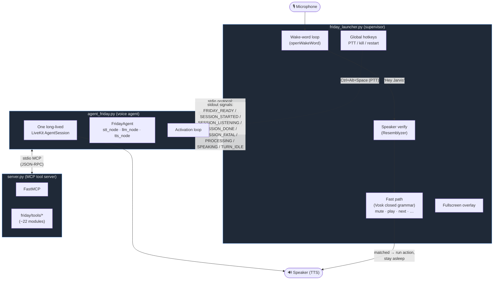
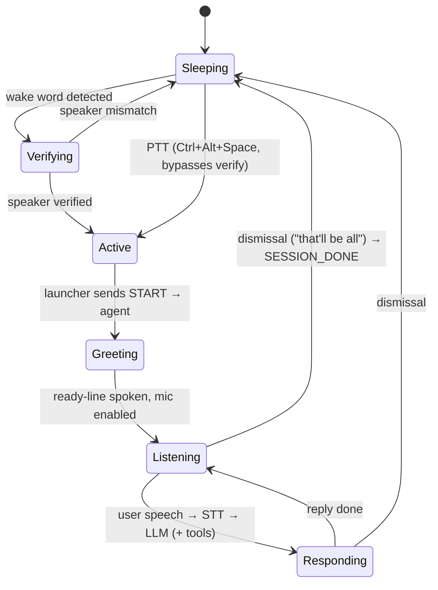
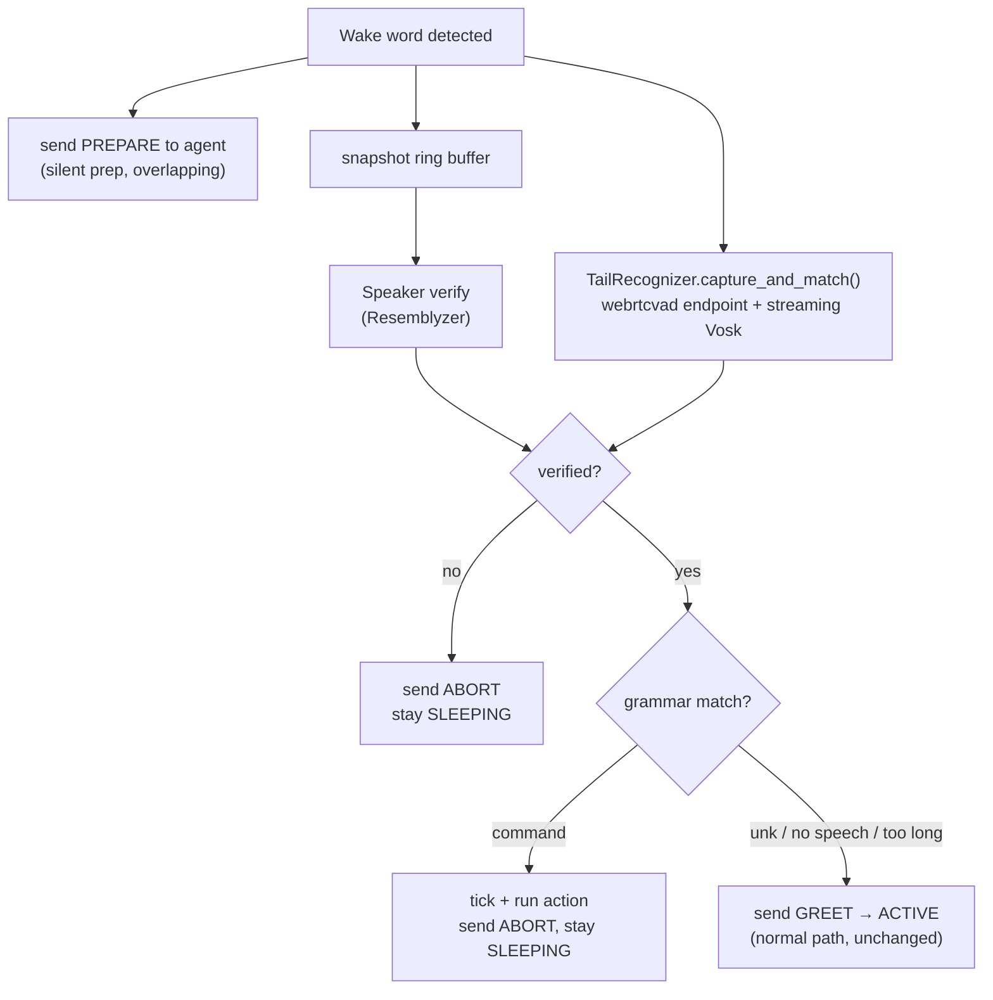
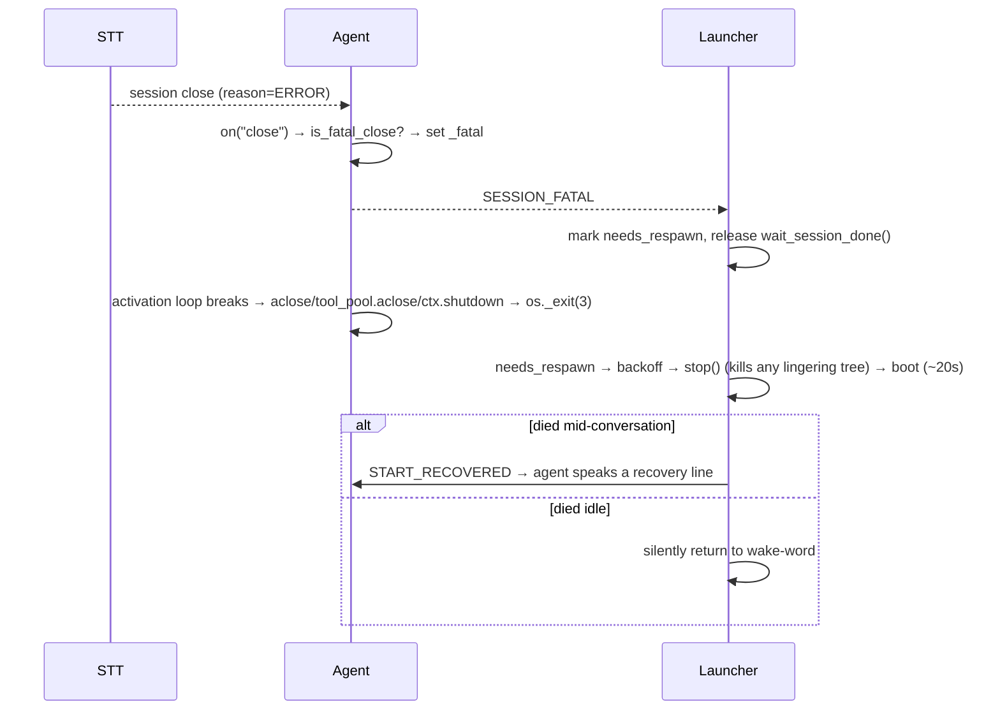
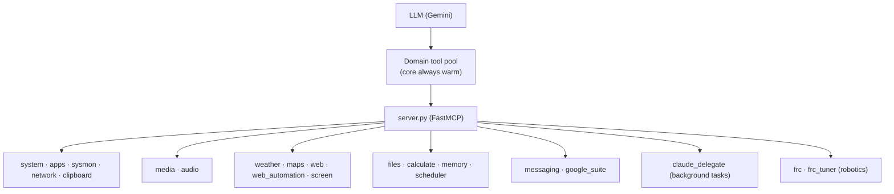
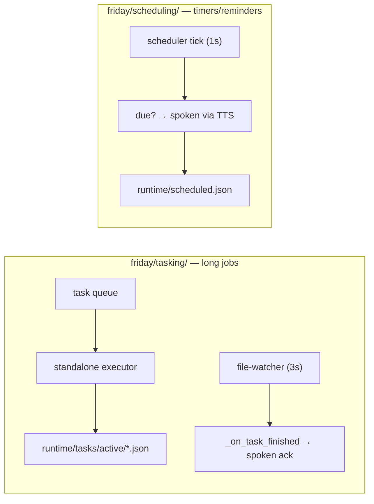

# FRIDAY — Architecture & Feature Diagrams

> **Living document.** Diagrams render on GitHub / VS Code (Mermaid). When you add a
> new feature, tool, process, or data flow, **update the relevant diagram and the
> Feature Map below** in the same change. Keep it matched to reality, not aspiration.
>
> Companion docs: [`CODEBASE.md`](CODEBASE.md) (prose map) · [`CAPABILITY_PLAN.md`](CAPABILITY_PLAN.md) (product direction) · [`TOOL_ROUTING_DESIGN.md`](TOOL_ROUTING_DESIGN.md).

---

## 1. System overview — three cooperating processes

FRIDAY is a Windows voice assistant that runs as **three processes**. The launcher
owns the machine-facing bits (mic, hotkeys, overlay) and supervises a long-lived
agent; the agent runs one LiveKit voice session and talks to a local MCP tool server.



**Why 3 processes?** Latency + isolation. The wake-word loop must never block the
conversation; the agent stays warm across dismissals; the tool server can be
restarted independently. The launcher **respawns the agent if it dies** — the basis
of the recovery feature (§5).

Process comms:
- **Launcher → Agent:** writes commands to the agent's **stdin** (`START`, `START_RECOVERED`, `PREPARE`, `GREET`, `ABORT`, `QUIT`, `INTERRUPT`). `PREPARE` starts **silent** prep (STT reconnect, no speech, no mic) the instant the wake word fires, so it overlaps the launcher's fast-path tail capture; it is then completed by `GREET` (speak the ready line, open the mic) or cancelled by `ABORT` (a fast-path command handled the request, or the speaker failed verification — no session begins, no `SESSION_DONE`). `START` is `PREPARE`+`GREET` in one, still used by the PTT and fatal-recovery paths. If no `GREET`/`ABORT` arrives within `PREPARE_WAIT_TIMEOUT` (5s), the agent aborts rather than sitting half-activated.
- **Agent → Launcher:** prints **stdout signals** the launcher parses (`FRIDAY_READY`, `SESSION_STARTED`, `SESSION_LISTENING`, `SESSION_DONE`, `SESSION_FATAL`, `PROCESSING`, `SPEAKING`, `TURN_IDLE`). Overlay: `PROCESSING` → "Thinking...", `SPEAKING` → speaking bars, `TURN_IDLE` (an LLM turn ended with nothing said and no tool to run — e.g. the prompt's silence after a successful action, or a failed LLM call) → back to listening.
- **Agent ↔ MCP server:** `MCPServerStdio` spawns `server.py` as a child; tools are called over stdio JSON-RPC.

---

## 2. Boot sequence (`uv run friday_start`)

```mermaid
sequenceDiagram
    participant L as Launcher
    participant A as Agent
    participant S as MCP server
    L->>L: disable power throttling, start overlay
    L->>A: spawn agent_friday.py console FIRST (stdin/stdout pipes)
    Note over L: while the agent boots: load wake-word model (openwakeword,<br/>~12s cold import), speaker verifier, Vosk fast path; arm hotkeys
    Note over A: apply Windows net patches (IPv4-only, sequential connect)<br/>+ force console APM OFF  (module import, before livekit)
    A->>A: warm providers (STT/LLM/TTS) + speaker gate (parallel;<br/>gate skips Resemblyzer entirely while disabled)
    A->>A: pre-warm Google TTS grpc channel (list_voices)  ← avoids first-call hang
    A->>S: spawn server.py, register core toolset
    A->>A: session.start() — acquire console audio, mic gated OFF
    A-->>L: FRIDAY_READY
    L->>L: start wake-word stream → "say 'Hey Jarvis'"
```

Boot is front-loaded on purpose: the LiveKit session, providers, and TTS grpc channel
are all warmed **before** `FRIDAY_READY`, so the first activation pays no cold-start cost.

**Boot budget** (measured 2026-09-21/22): agent spawn → `FRIDAY_READY` ~20s (was
~40s); whole launcher, launch → "say 'Hey Jarvis'" ~21s (was ~42s). The launcher
spawns the agent before loading its own models so the two overlap — keep
`openwakeword` imported lazily inside `WakeWordListener` (at module level it delayed
the spawn ~12s). Guarded by `tests/test_launcher_boot_order.py`. `session.start()` waits for the MCP server, so the server's import time is on
the critical path — keep `friday.tools` free of the voice stack
(`friday/tasking/__init__.py` resolves its API lazily for exactly this reason; it used
to pull LiveKit + Google Cloud into the tool server, ~22s cold). Guarded by
`tests/test_boot_imports.py`. The launcher waits up to `BOOT_TIMEOUT` (120s) and
retries a failed boot `BOOT_ATTEMPTS` times with backoff instead of exiting — cold
boots after a reboot have exceeded the old fixed 60s.

---

## 3. Conversation lifecycle



- **Activation** requires the enrolled voice at the **wake word** (launcher's speaker
  verify) *or* a PTT keypress (bypasses verify).
- **Silent-mic false wakes** are dropped before verification: openwakeword
  occasionally fires on a near-silent mic, and a wake buffer that never peaks above
  `WAKE_SILENCE_PEAK` is ignored without flashing the overlay or sending `PREPARE`
  (Resemblyzer scores such audio ≤ 0.63, so verification would reject it anyway).
- **Dismissal** is matched case- and punctuation-insensitively, as whole words
  (`_is_dismissal`), so Deepgram's "Goodbye, Jarvis." hits `goodbye jarvis` while
  "understand download" does not hit `stand down`. The session then ends when the
  sign-off has **finished playing** (`agent_state_changed` speaking → not speaking,
  via `_wait_for_signoff`; capped at `SIGNOFF_START_TIMEOUT` 5s to start and
  `SIGNOFF_MAX_SPEECH` 10s to play) instead of after a fixed 6s, so the wake word is
  back as soon as JARVIS stops talking.
- The **per-transcript** speaker gate inside the session is currently **OFF**
  (`SESSION_SPEAKER_GATE_ENABLED = False`) — see §4 and §6.

### Fast path — commands that never reach the agent

Fixed phrases spoken in the same breath as the wake word ("Hey Jarvis, mute") are
recognized and executed **inside the launcher**. No session, no Gemini, no MCP, no
TTS — ~0.4 s versus ~5–7 s through the normal path.



Bail conditions, in order: no speech within `FASTPATH_LEAD_TIMEOUT_MS` (bare
"Hey Jarvis"); speech exceeds `FASTPATH_MAX_SPEECH_MS` (a real request, not a
command); final decode is `[unk]`. All three fall through to normal activation.

- **Command table:** `friday/fastpath/registry.py` — adding a command is one line.
  The Vosk grammar is derived from the table, so a new phrase is recognizable
  automatically.
- **Vocabulary trap:** Vosk silently *drops* words missing from the model's
  vocabulary, making the owning command permanently unmatchable with no runtime
  symptom. `unmute` is one such word (hence "sound on").
  `tests/test_fastpath_vocabulary.py` guards this — it must run the probe in a
  subprocess, because the vosk DLL links its own CRT on Windows and `os.dup2` on
  our fd 2 does not capture its warnings.
- **No early bail on partials.** The 2026-08-01 spike found Vosk emits no partial
  for the first ~880 ms of capture, in-grammar and out alike, so there is nothing
  to reject on before the speech cap fires.
- If the Vosk model is missing or fails to load, the fast path disables itself and
  the launcher behaves exactly as it did before the feature.

---

## 4. Audio pipeline (mic → response)

This is the path a spoken command takes. **Two boxes are the historically painful
ones** (marked ⚠) — see §6 for why.


**Providers** ([`friday/config.py`](friday/config.py) + [`friday/providers.py`](friday/providers.py)): STT=`deepgram`, LLM=`gemini` (`gemini-2.5-flash`), TTS=`google` (Charon).

**Echo guard:** because console AEC is off *and* the speaker gate is off, the mic is
muted while the agent talks (`discard_audio_if_uninterruptible=True`) so FRIDAY never
transcribes its own voice.

**Speak-before-act:** for state-changing tools (open/close app, media, messaging,
reminders, files), the LLM emits a short spoken pre-line ("Opening Chrome, sir.")
*before* the `tool call` edge above, then acts, then stays silent on plain success.
This is prompt-driven (`SYSTEM_PROMPT` "ACTING OUT LOUD" rule in
[`friday/config.py`](friday/config.py)) — LiveKit speaks text that precedes a tool
call in the stream. Pure lookups (math, weather, search) get no pre-line.

---

## 5. Failure recovery (STT session death)

If the STT/connection dies unrecoverably, LiveKit closes the session. The agent turns
that into a **process exit** so the launcher's respawn brings it back.



- **The agent must exit its own process.** Console mode keeps the process alive after
  `ctx.shutdown()`; before the explicit `os._exit`, a fatal close left a zombie agent
  that the launcher (which respawned only on process death) kept sending wake words
  to — ~20 times in the Aug–Sep 2026 logs, each needing a manual restart. The launcher
  now also treats `SESSION_FATAL` itself as "needs respawn", so a lingering process
  is killed rather than trusted.
- **Backoff:** `respawn_backoff` (0, 2, 4, … capped at 30s). An agent that dies within
  `STABLE_UPTIME` (60s) of `FRIDAY_READY` — e.g. network down at boot, Deepgram fails
  a second later — counts as a failed respawn, so an offline machine doesn't reboot
  the agent in a tight loop.

Code: [`friday/recovery.py`](friday/recovery.py) (`is_fatal_close`, `should_announce_recovery`, `respawn_backoff`, `next_respawn_failures`), close handler + `_fatal`/`_intentional` flags in [`agent_friday.py`](agent_friday.py), `AgentProcess.needs_respawn` / `boot()` / `boot_with_retries` in [`friday_launcher.py`](friday_launcher.py). Prevention: widened STT retry/timeout (`STT_MAX_RETRY`, `STT_TIMEOUT`).

---

## 6. Windows / platform gotchas (applied fixes)

These are non-obvious workarounds baked into `agent_friday.py`. **Do not remove without
understanding why** — each cost a long debugging trail.

| Fix | Where | Problem it solves |
|-----|-------|-------------------|
| **IPv4-only DNS + sequential connect** | `_force_ipv4_resolution`, `_patch_anyio_happy_eyeballs` (top of agent_friday.py) | Windows `ProactorEventLoop` wedges forever when a losing IPv4/IPv6 "happy-eyeballs" TCP connect is cancelled → the greeting/LLM connection hung. Escape hatch: `FRIDAY_DISABLE_NET_PATCHES=1`. |
| **Google TTS grpc channel warmup** | pre-warm block after providers | grpc establishes the HTTP/2 connection lazily on first synthesis, under session load, and hangs. Warming `list_voices()` at boot connects it early. |
| **Console APM forced OFF** | `_force_console_apm_off` | livekit's console `AudioProcessingModule` (AEC+NS+AGC) stripped the user's voice to the noise floor → STT got silence → no transcripts. Escape hatch: `FRIDAY_KEEP_APM=1`. |
| **Echo guard** | `discard_audio_if_uninterruptible=True` | With APM + speaker gate off, prevents transcribing the agent's own TTS. |
| **Resemblyzer warmed at boot** | `SpeakerVerifier.warm` (friday_launcher.py) | The first `embed_utterance()` call JIT-compiles librosa/numba and takes **~4.6s**; every call after is ~20ms. The first wake word after every boot therefore stalled ~5s inside speaker verification — long enough to blow past the agent's `PREPARE_WAIT_TIMEOUT` and abort the activation. Warmed on a background thread during boot, where it overlaps the agent's cold start. Encoder use is lock-guarded so warmup can't race a wake word. |
| **Stray `GREET` must not shut the agent down** | `_normalize_activation_cmd` (agent_friday.py) | If a `PREPARE` handshake times out, the agent returns to the outer activation wait. A `GREET` landing there was unrecognised and hit the shutdown branch — killing the live session. Only `QUIT`/`FATAL`/EOF may shut down; a late `GREET` is honoured as a full `START` (the launcher is blocked in `wait_session_done()` and would otherwise hang). Guarded by `tests/test_activation_protocol.py`. |
| **Bounded LLM retries** | `LLM_MAX_RETRY` (config) → `build_session_conn_options` | Gemini returns an *empty* completion when the prompt asks for silence (after a plainly successful action); the livekit google plugin raises that as a retryable `no response generated`. At livekit's default (3 retries, 2s apart) each silent turn was ~6s of dead air with the mic deaf (interruptions are off). One immediate retry keeps network-blip cover. |
| **Never `taskkill` explorer.exe or python** | `close_app` (friday/tools/apps.py) | `explorer.exe` hosts File Explorer windows **and** the Windows shell (taskbar, Start menu, Alt+Tab): "close File Explorer" ran `taskkill /F /IM explorer.exe` and took the desktop down. File Explorer is now closed window-by-window (`WM_CLOSE` to `CabinetWClass` windows); `python.exe`/`pythonw.exe` (JARVIS itself) are refused; the PowerShell title-match fallback filters protected processes before matching. Guarded by `tests/test_close_app.py`. |
| **Restart hotkey needs `start_friday.vbs`** | `_spawn_relaunch` (friday_launcher.py) | The restart hotkey and the Windows Startup shortcut both run `start_friday.vbs`. `wscript.exe` "succeeds" on a missing script, so the hotkey used to kill JARVIS and spawn nothing; it now refuses to restart when the script is missing. |
| **Mic gated BEFORE `session.start()`** | `_pre_gate_mic` (agent_friday.py) | `ConsoleAudioInput` is *attached by default* and queues mic frames into an unbounded channel from the moment `start()` creates it; `AgentSession._forward_audio_task` drains that channel without ever checking `input.audio_enabled`. Gating *after* start therefore still leaked the captured backlog into Deepgram, which endpointed the burst into a hallucinated `"Mhmm."` and fired a full LLM turn (4 failing Gemini calls) at every boot. Gating first makes the `AgentInput.audio` setter call `on_detached()` at assignment, so frames are dropped at the source. Guarded by `tests/test_audio_gate_ordering.py`. |

> ⚠️ **Note (server.py):** the MCP tool server is a **separate process without the net
> patches**. Network tools that call APIs (e.g. `read_screen` → Gemini vision) can be
> slow/fragile there; heavy calls can exceed the MCP 30s response cap.

---

## 7. Feature map (MCP tools)

All tools live in [`friday/tools/`](friday/tools/) as FastMCP-decorated functions,
auto-registered via `register_all_tools`. A **domain tool pool** ([`friday/routing/`](friday/routing/))
keeps a small core surface warm and routes heavier domains in on demand.



| Domain | Modules | What it does |
|--------|---------|--------------|
| System | `system`, `apps`, `sysmon`, `network`, `clipboard` | launch apps, system control, CPU/mem, IP/geo, clipboard |
| Media | `media`, `audio` | play/pause/volume, audio devices. Control primitives live in `friday/media_control.py` (no MCP imports) and are shared with the launcher fast path (§3) |
| Info / vision | `weather`, `maps`, `web`, `web_automation`, `screen` | forecasts, directions, search, browser automation, **pull-up** (`open_on_screen`: URL/search/file), screen reading — single view (`read_screen`) and **scroll-and-read past the viewport** (`read_long_content`, Gemini vision) |
| Productivity | `files`, `calculate`, `memory`, `scheduler` | file ops, math, persistent prefs, timers/reminders |
| Comms | `messaging`, `google_suite` | messages, Gmail/Calendar/Drive |
| Background | `claude_delegate` | hands slow/multi-step work to a background Claude executor |
| Robotics | `frc`, `frc_tuner` | FRC build/sim/dashboard, NetworkTables PID tuning |

**Screen reach & read:** `open_on_screen` ([`friday/tools/web.py`](friday/tools/web.py))
pulls up a URL, a Google search, or a local file/folder (files bounded to
`FRIDAY_FILE_ROOTS` via files.py's `_resolve_and_check`). `read_long_content`
([`friday/tools/screen.py`](friday/tools/screen.py)) reads content past the
viewport: it scrolls the active window (`pyautogui`) and captures frames until they
stop changing ([`friday/screen_scroll.py`](friday/screen_scroll.py), capped at 12
scrolls), then sends the sequence to Gemini vision as one multi-image call and
answers over all of it. `read_screen` remains the single-visible-screen path.

---

## 8. Background layers



Slow / multi-step work goes to the **task layer** (quick spoken ack now, result spoken
later) so it never blocks the reply path. Timers and reminders fire through the same
session's TTS.

**Loop-until-success engine** ([`friday/looping/`](friday/looping/)): a background,
bounded, cancellable "do X until Y" runner. `run_until` (MCP, in
[`friday/tools/loops.py`](friday/tools/loops.py)) maps a natural-language "keep doing X
until Y" onto a curated action + success-check (`registry.py`) and spawns a daemon-thread
loop (`runner.run_loop`, no LLM per iteration). It drives a `TaskRecord`, so the same
file-watcher callback above speaks the loop's success/failure. Bounds are clamped
(interval ≥1s, ≤60 attempts, ≤15 min) and ≤3 loops run at once; `stop_loop` and the kill
switch cancel them. Generalizes the hardcoded `monitor_wifi_connection` loop.

---

## Where things live (quick index)

| What | Path |
|------|------|
| Launcher (wake word, overlay, hotkeys, supervision) | `friday_launcher.py` |
| Voice agent (session, stt/llm/tts nodes, activation loop) | `agent_friday.py` |
| MCP tool server | `server.py` |
| Providers (STT/LLM/TTS builders, conn options) | `friday/providers.py` |
| Config (providers, prompt, thresholds, flags) | `friday/config.py` |
| Session recovery helpers | `friday/recovery.py` |
| Speaker gate (in-session verification) | `friday/speaker_gate.py` |
| Fast-path voice commands (launcher, no LLM) | `friday/fastpath/` — command table in `registry.py` |
| Shared media control (volume, mute, transport) | `friday/media_control.py` |
| Vosk model (fast path, ~40MB, gitignored) | `models/vosk-model-small-en-us-0.15/` |
| Tools (features) | `friday/tools/*.py` |
| Tool routing / domain pool | `friday/routing/` |
| Background tasks | `friday/tasking/` |
| Loop-until-success engine ("do X until Y") | `friday/looping/` + `friday/tools/loops.py` |
| Scroll-capture engine (read past the viewport) | `friday/screen_scroll.py` + `read_long_content` in `friday/tools/screen.py` |
| Timers & reminders | `friday/scheduling/` |
| Runtime state (tasks, memory, schedules) | `runtime/` |
| Speaker embedding | `voice_embedding.npy` / `speaker_profile.npz` |
| Logs | `logs/friday.log` |
