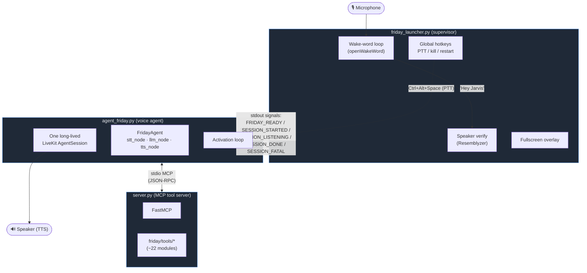
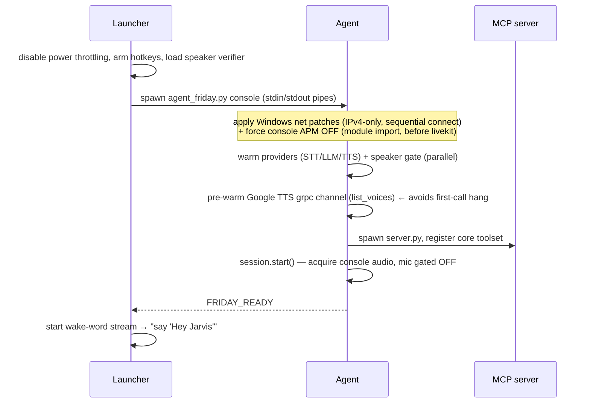
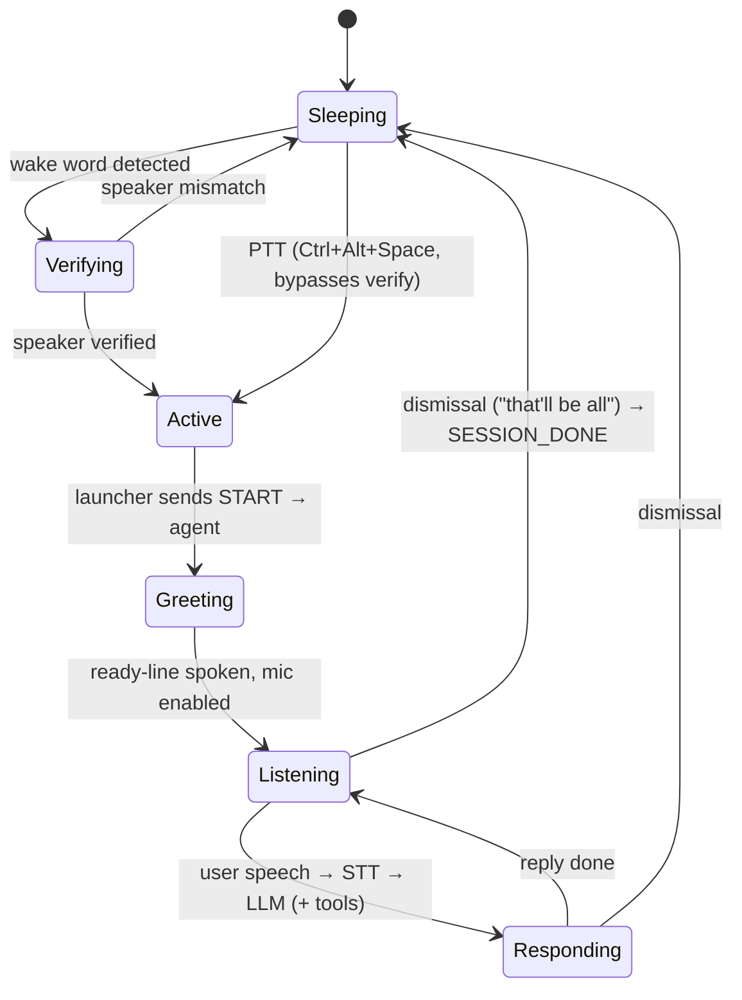
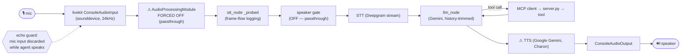
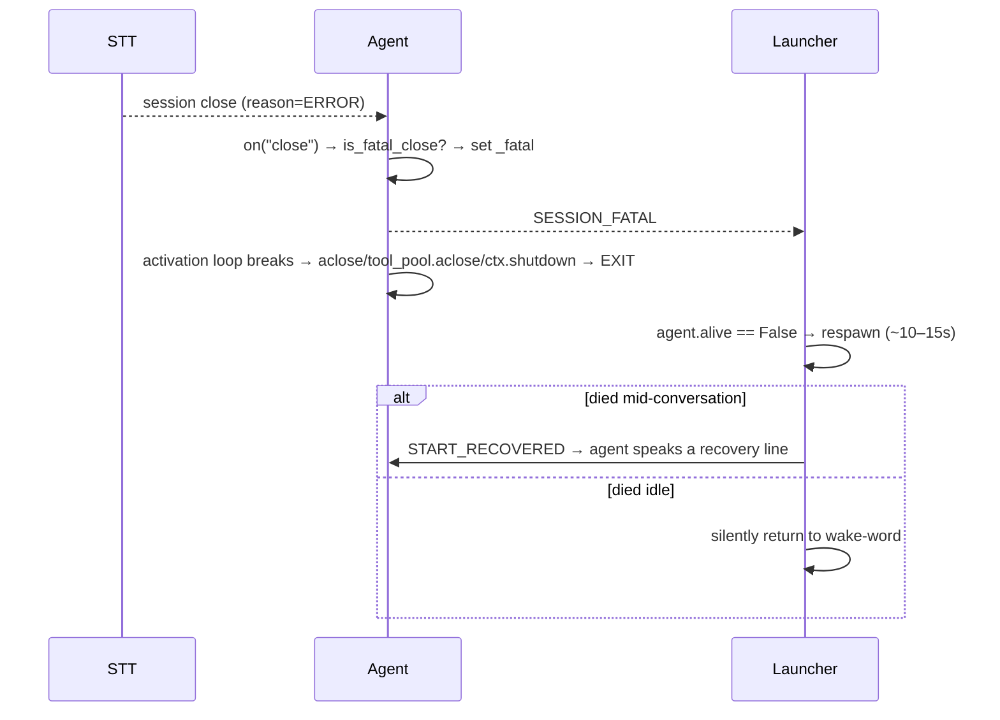
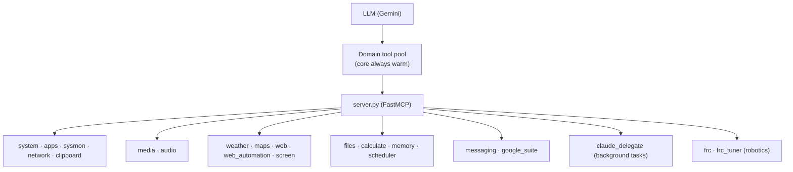
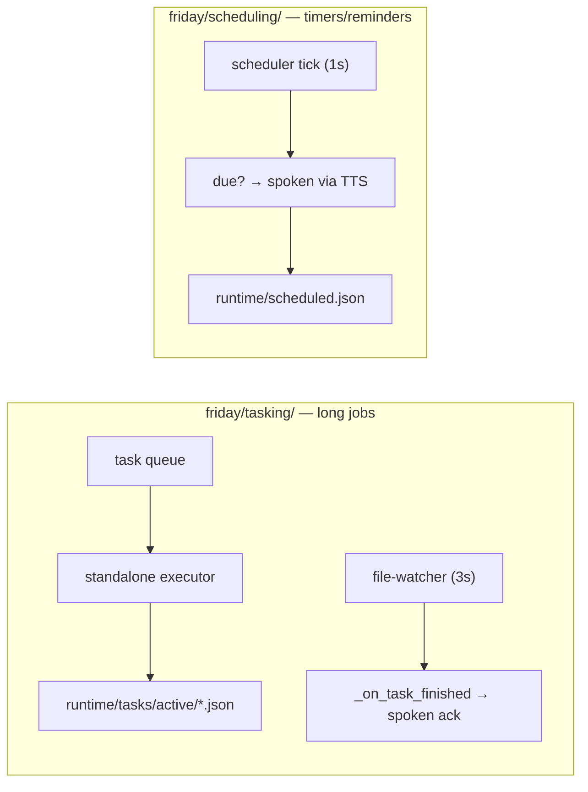

# FRIDAY — Architecture & Feature Diagrams

> **Living document.** Diagrams render on GitHub / VS Code (Mermaid). When you add a
> new feature, tool, process, or data flow, **update the relevant diagram and the
> Feature Map below** in the same change. Keep it matched to reality, not aspiration.
>
> Companion docs: [`CODEBASE.md`](CODEBASE.md) (prose map) · [`CAPABILITY_PLAN.md`](CAPABILITY_PLAN.md) (product direction) · [`TOOL_ROUTING_DESIGN.md`](TOOL_ROUTING_DESIGN.md).

---

## 1. System overview — three cooperating processes

FRIDAY is a Windows voice assistant that runs as **three processes**. The launcher
owns the machine-facing bits (mic, hotkeys, overlay) and supervises a long-lived
agent; the agent runs one LiveKit voice session and talks to a local MCP tool server.

**Why 3 processes?** Latency + isolation. The wake-word loop must never block the
conversation; the agent stays warm across dismissals; the tool server can be
restarted independently. The launcher **respawns the agent if it dies** — the basis
of the recovery feature (§5).

Process comms:
- **Launcher → Agent:** writes commands to the agent's **stdin** (`START`, `START_RECOVERED`, `QUIT`, `INTERRUPT`).
- **Agent → Launcher:** prints **stdout signals** the launcher parses (`FRIDAY_READY`, `SESSION_STARTED`, `SESSION_LISTENING`, `SESSION_DONE`, `SESSION_FATAL`, `PROCESSING`, `SPEAKING`).
- **Agent ↔ MCP server:** `MCPServerStdio` spawns `server.py` as a child; tools are called over stdio JSON-RPC.

---

## 2. Boot sequence (`uv run friday_start`)

Boot is front-loaded on purpose: the LiveKit session, providers, and TTS grpc channel
are all warmed **before** `FRIDAY_READY`, so the first activation pays no cold-start cost.

---

## 3. Conversation lifecycle

- **Activation** requires the enrolled voice at the **wake word** (launcher's speaker
  verify) *or* a PTT keypress (bypasses verify).
- The **per-transcript** speaker gate inside the session is currently **OFF**
  (`SESSION_SPEAKER_GATE_ENABLED = False`) — see §4 and §6.

---

## 4. Audio pipeline (mic → response)

This is the path a spoken command takes. **Two boxes are the historically painful
ones** (marked ⚠) — see §6 for why.

**Providers** ([`friday/config.py`](friday/config.py) + [`friday/providers.py`](friday/providers.py)): STT=`deepgram`, LLM=`gemini` (`gemini-2.5-flash`), TTS=`google` (Charon).

**Echo guard:** because console AEC is off *and* the speaker gate is off, the mic is
muted while the agent talks (`discard_audio_if_uninterruptible=True`) so FRIDAY never
transcribes its own voice.

---

## 5. Failure recovery (STT session death)

If the STT/connection dies unrecoverably, LiveKit closes the session. The agent turns
that into a **process exit** so the launcher's existing respawn brings it back.

Code: [`friday/recovery.py`](friday/recovery.py) (`is_fatal_close`, `should_announce_recovery`), close handler + `_fatal`/`_intentional` flags in [`agent_friday.py`](agent_friday.py), signal handling in [`friday_launcher.py`](friday_launcher.py). Prevention: widened STT retry/timeout (`STT_MAX_RETRY`, `STT_TIMEOUT`).

---

## 6. Windows / platform gotchas (applied fixes)

These are non-obvious workarounds baked into `agent_friday.py`. **Do not remove without
understanding why** — each cost a long debugging trail.

| Fix | Where | Problem it solves |
|-----|-------|-------------------|
| **IPv4-only DNS + sequential connect** | `_force_ipv4_resolution`, `_patch_anyio_happy_eyeballs` (top of agent_friday.py) | Windows `ProactorEventLoop` wedges forever when a losing IPv4/IPv6 "happy-eyeballs" TCP connect is cancelled → the greeting/LLM connection hung. Escape hatch: `FRIDAY_DISABLE_NET_PATCHES=1`. |
| **Google TTS grpc channel warmup** | pre-warm block after providers | grpc establishes the HTTP/2 connection lazily on first synthesis, under session load, and hangs. Warming `list_voices()` at boot connects it early. |
| **Console APM forced OFF** | `_force_console_apm_off` | livekit's console `AudioProcessingModule` (AEC+NS+AGC) stripped the user's voice to the noise floor → STT got silence → no transcripts. Escape hatch: `FRIDAY_KEEP_APM=1`. |
| **Echo guard** | `discard_audio_if_uninterruptible=True` | With APM + speaker gate off, prevents transcribing the agent's own TTS. |

> ⚠️ **Note (server.py):** the MCP tool server is a **separate process without the net
> patches**. Network tools that call APIs (e.g. `read_screen` → Gemini vision) can be
> slow/fragile there; heavy calls can exceed the MCP 30s response cap.

---

## 7. Feature map (MCP tools)

All tools live in [`friday/tools/`](friday/tools/) as FastMCP-decorated functions,
auto-registered via `register_all_tools`. A **domain tool pool** ([`friday/routing/`](friday/routing/))
keeps a small core surface warm and routes heavier domains in on demand.

| Domain | Modules | What it does |
|--------|---------|--------------|
| System | `system`, `apps`, `sysmon`, `network`, `clipboard` | launch apps, system control, CPU/mem, IP/geo, clipboard |
| Media | `media`, `audio` | play/pause/volume, audio devices |
| Info / vision | `weather`, `maps`, `web`, `web_automation`, `screen` | forecasts, directions, search, browser automation, screen reading (Gemini vision) |
| Productivity | `files`, `calculate`, `memory`, `scheduler` | file ops, math, persistent prefs, timers/reminders |
| Comms | `messaging`, `google_suite` | messages, Gmail/Calendar/Drive |
| Background | `claude_delegate` | hands slow/multi-step work to a background Claude executor |
| Robotics | `frc`, `frc_tuner` | FRC build/sim/dashboard, NetworkTables PID tuning |

---

## 8. Background layers

Slow / multi-step work goes to the **task layer** (quick spoken ack now, result spoken
later) so it never blocks the reply path. Timers and reminders fire through the same
session's TTS.

---

## Where things live (quick index)

| What | Path |
|------|------|
| Launcher (wake word, overlay, hotkeys, supervision) | `friday_launcher.py` |
| Voice agent (session, stt/llm/tts nodes, activation loop) | `agent_friday.py` |
| MCP tool server | `server.py` |
| Providers (STT/LLM/TTS builders, conn options) | `friday/providers.py` |
| Config (providers, prompt, thresholds, flags) | `friday/config.py` |
| Session recovery helpers | `friday/recovery.py` |
| Speaker gate (in-session verification) | `friday/speaker_gate.py` |
| Tools (features) | `friday/tools/*.py` |
| Tool routing / domain pool | `friday/routing/` |
| Background tasks | `friday/tasking/` |
| Timers & reminders | `friday/scheduling/` |
| Runtime state (tasks, memory, schedules) | `runtime/` |
| Speaker embedding | `voice_embedding.npy` / `speaker_profile.npz` |
| Logs | `logs/friday.log` |
