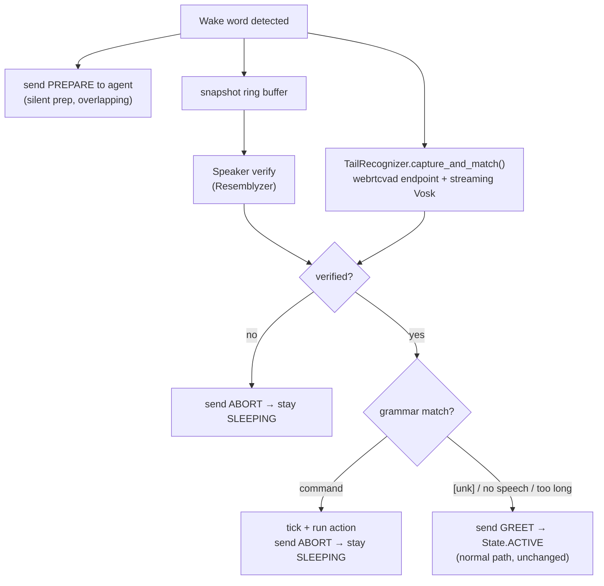

# Fast-Path Voice Commands Implementation Plan

> **For agentic workers:** REQUIRED SUB-SKILL: Use superpowers:subagent-driven-development (recommended) or superpowers:executing-plans to implement this plan task-by-task. Steps use checkbox (`- [ ]`) syntax for tracking.

> **Git:** The repo owner commits all work himself. **Do not run `git add`, `git commit`, `git reset`, or create branches/worktrees.** Leave every change uncommitted in the working tree on `main`. Each task ends with a verification step instead of a commit.

**Goal:** Make a fixed set of state-change voice commands ("Hey Jarvis, mute") execute in ~0.4 s by handling them entirely inside `friday_launcher.py` — no agent session, no Gemini, no MCP, no TTS.

**Architecture:** After the wake word fires, the launcher sends `PREPARE` to the agent (silent prep work, overlapping) while concurrently running speaker verification and capturing the ~1 s of speech that follows the wake word. That tail is endpointed with `webrtcvad` and decoded by Vosk against a **closed grammar** built from the command table, so the recognizer can only emit a known command or `[unk]`. A match runs a plain Python action and returns to sleep. Anything else sends `GREET` and the existing path proceeds unchanged.

**Tech Stack:** Python 3.11, `vosk` (new), `webrtcvad` (already installed), `pyaudio`, `pycaw`, `keyboard`, pytest.

**Spec:** [docs/superpowers/specs/2026-08-01-fast-path-voice-commands-design.md](../specs/2026-08-01-fast-path-voice-commands-design.md)

---

## File Structure

| File | Responsibility |
|---|---|
| `friday/media_control.py` | **New.** Plain volume/mute/media-key control. No MCP imports. Shared by the tool layer and the fast path. |
| `friday/tools/media.py` | **Modify.** Keeps `register(mcp)` wrappers + Spotify search; delegates control to `friday/media_control.py`. |
| `friday/fastpath/__init__.py` | **New.** Package marker. |
| `friday/fastpath/model.py` | **New.** One-time Vosk model download/validation. |
| `friday/fastpath/actions.py` | **New.** Zero-arg callables the command table binds to. |
| `friday/fastpath/registry.py` | **New.** The command table, grammar builder, and lookup. |
| `friday/fastpath/recognizer.py` | **New.** Tail capture, VAD endpointing, streaming Vosk decode. |
| `friday/config.py` | **Modify.** Fast-path tuning constants. |
| `agent_friday.py` | **Modify.** `PREPARE`/`GREET`/`ABORT` protocol in the activation loop + stdin dispatch. |
| `friday_launcher.py` | **Modify.** `read_chunk`, ack clip, `AgentProcess` send methods, `SLEEPING` branch wiring. |
| `pyproject.toml` | **Modify.** Add `vosk` and the missing `webrtcvad`. |
| `.gitignore` | **Modify.** Ignore `models/`. |
| `ARCHITECTURE.md` | **Modify.** Launcher diagram + Feature Map. |

Task order matters: 1 → 2 → 3 → 4 → 5 → 6 → 7 → 8 → 9 → 10 → 11, with Task 0 (spike) run first because its result sets one config default in Task 5 and one branch in Task 6.

---

## Task 0: Spike — does Vosk's grammar partial reject early?

**Purpose:** The design's early-bail step assumes a grammar-constrained `PartialResult()` can tell "this isn't a command" within ~400 ms of speech. Verify before building on it.

**Files:**
- Create: `spike_vosk_partials.py` (repo root, temporary — deleted in Step 6)

- [ ] **Step 1: Install vosk**

Run: `uv add vosk`
Expected: resolves and installs a `vosk` cp311 win_amd64 wheel.

- [ ] **Step 2: Download the model manually for the spike**

Run:
```bash
mkdir -p models
curl -L -o models/vosk.zip https://alphacephei.com/vosk/models/vosk-model-small-en-us-0.15.zip
cd models && unzip -q vosk.zip && rm vosk.zip && cd ..
ls models/vosk-model-small-en-us-0.15
```
Expected: a directory containing `am/`, `conf/`, `graph/`, `ivector/`.

- [ ] **Step 3: Write the spike script**

Create `spike_vosk_partials.py`:

```python
"""SPIKE (temporary): does Vosk's grammar-constrained PartialResult() reject
out-of-grammar speech early enough to bail before the 1s cap?

Run: uv run python spike_vosk_partials.py
Speak each prompted phrase, then read the per-80ms partial trace.
"""
import json
import sys

import pyaudio
from vosk import KaldiRecognizer, Model, SetLogLevel

SetLogLevel(-1)

RATE = 16000
CHUNK = 1280  # 80 ms, same as the launcher
MODEL_DIR = "models/vosk-model-small-en-us-0.15"

GRAMMAR = [
    "mute", "unmute", "play", "pause", "next", "skip", "next track",
    "back", "previous", "previous track", "louder", "volume up",
    "quieter", "volume down", "stop", "[unk]",
]

IN_GRAMMAR = ["mute", "play", "next track", "volume up"]
OUT_OF_GRAMMAR = [
    "what's the weather in Boston",
    "remind me to call the dentist tomorrow",
    "open my email and read the latest one",
]


def trace(model, phrase, seconds=2.0):
    rec = KaldiRecognizer(model, RATE, json.dumps(GRAMMAR))
    pa = pyaudio.PyAudio()
    stream = pa.open(format=pyaudio.paInt16, channels=1, rate=RATE,
                     input=True, frames_per_buffer=CHUNK)
    print(f"\n=== SAY: {phrase!r} ===")
    input("press Enter, then speak immediately... ")
    rows = []
    for i in range(int(RATE / CHUNK * seconds)):
        raw = stream.read(CHUNK, exception_on_overflow=False)
        rec.AcceptWaveform(raw)
        partial = json.loads(rec.PartialResult()).get("partial", "")
        rows.append(((i + 1) * 80, partial))
    stream.stop_stream()
    stream.close()
    pa.terminate()
    final = json.loads(rec.FinalResult()).get("text", "")
    for ms, partial in rows:
        print(f"  {ms:5d} ms  partial={partial!r}")
    print(f"  FINAL: {final!r}")
    return rows, final


def main():
    model = Model(MODEL_DIR)
    results = {}
    for phrase in IN_GRAMMAR + OUT_OF_GRAMMAR:
        results[phrase] = trace(model, phrase)

    print("\n\n======== SUMMARY ========")
    print("Question 1: at 400ms, is the partial for OUT-OF-GRAMMAR speech")
    print("            empty, or non-empty-but-not-a-command-prefix?")
    print("Question 2: at 400ms, is the partial for IN-GRAMMAR speech")
    print("            a non-empty prefix of the spoken command?")
    for phrase, (rows, final) in results.items():
        at400 = next((p for ms, p in rows if ms == 400), None)
        kind = "IN " if phrase in IN_GRAMMAR else "OUT"
        print(f"  [{kind}] {phrase[:40]:42s} @400ms={at400!r} final={final!r}")
    return 0


if __name__ == "__main__":
    sys.exit(main())
```

- [ ] **Step 4: Run the spike**

Run: `uv run python spike_vosk_partials.py`
Speak each prompted phrase clearly into the wake mic.

- [ ] **Step 5: Record the decision**

Read the summary table and decide:

| Observation at 400 ms | Decision |
|---|---|
| Out-of-grammar partials are consistently **empty**, in-grammar are **non-empty** | `FASTPATH_BAIL_ON_EMPTY_PARTIAL = True`, early bail **enabled** |
| Out-of-grammar partials are non-empty but never a command prefix | `FASTPATH_BAIL_ON_EMPTY_PARTIAL = False`, early bail **enabled** (prefix test alone) |
| Partials are empty for *both* in- and out-of-grammar at 400 ms | Early bail **disabled** — set `FASTPATH_PARTIAL_CHECK_MS = 0` in Task 5 |

Write the outcome as a one-line comment at the top of the `FASTPATH_*` block in Task 5, e.g. `# Spike 2026-08-01: out-of-grammar partials empty at 400ms → bail on empty.`

- [ ] **Step 6: Delete the spike script**

Run: `rm spike_vosk_partials.py`
Expected: file gone. The model in `models/` stays — Task 1 reuses it.

---

## Task 1: Vosk model bootstrap

**Files:**
- Create: `friday/fastpath/__init__.py`
- Create: `friday/fastpath/model.py`
- Create: `tests/test_fastpath_model.py`
- Modify: `pyproject.toml`
- Modify: `.gitignore`

- [ ] **Step 1: Write the failing test**

Create `tests/test_fastpath_model.py`:

```python
"""Tests for the Vosk model bootstrap."""
import friday.fastpath.model as model_mod


def test_returns_dir_when_model_present(tmp_path, monkeypatch):
    d = tmp_path / "vosk-model-small-en-us-0.15"
    d.mkdir()
    (d / "am").mkdir()
    monkeypatch.setattr(model_mod, "MODEL_DIR", d)
    assert model_mod.ensure_model(download=False) == d


def test_returns_none_when_absent_and_download_disabled(tmp_path, monkeypatch):
    monkeypatch.setattr(model_mod, "MODEL_DIR", tmp_path / "nope")
    assert model_mod.ensure_model(download=False) is None


def test_returns_none_when_dir_exists_but_empty(tmp_path, monkeypatch):
    d = tmp_path / "vosk-model-small-en-us-0.15"
    d.mkdir()
    monkeypatch.setattr(model_mod, "MODEL_DIR", d)
    assert model_mod.ensure_model(download=False) is None


def test_download_failure_returns_none_not_raises(tmp_path, monkeypatch):
    monkeypatch.setattr(model_mod, "MODEL_DIR", tmp_path / "nope")
    monkeypatch.setattr(model_mod, "MODEL_ROOT", tmp_path)

    def boom(*a, **kw):
        raise OSError("no network")

    monkeypatch.setattr(model_mod.urllib.request, "urlretrieve", boom)
    assert model_mod.ensure_model(download=True) is None
```

- [ ] **Step 2: Run test to verify it fails**

Run: `uv run pytest tests/test_fastpath_model.py -v`
Expected: FAIL — `ModuleNotFoundError: No module named 'friday.fastpath'`

- [ ] **Step 3: Create the package marker**

Create `friday/fastpath/__init__.py`:

```python
"""Launcher-side fast path: fixed voice commands that bypass the agent entirely."""
```

- [ ] **Step 4: Write the implementation**

Create `friday/fastpath/model.py`:

```python
"""One-time bootstrap for the Vosk small-English recognition model.

The model is ~40 MB and lives untracked under `models/`. Every failure path
returns None, which disables the fast path for that run — the launcher then
behaves exactly as it did before this feature existed.
"""
from __future__ import annotations

import logging
import shutil
import tempfile
import urllib.request
import zipfile
from pathlib import Path

logger = logging.getLogger("friday-launcher")

MODEL_NAME = "vosk-model-small-en-us-0.15"
MODEL_URL = f"https://alphacephei.com/vosk/models/{MODEL_NAME}.zip"
MODEL_ROOT = Path(__file__).parents[2] / "models"
MODEL_DIR = MODEL_ROOT / MODEL_NAME


def _looks_valid(path: Path) -> bool:
    """A usable Vosk model dir is non-empty. Vosk itself validates the rest."""
    return path.is_dir() and any(path.iterdir())


def ensure_model(download: bool = True) -> Path | None:
    """Return the model directory, downloading it once if missing.

    Returns None if the model is unavailable for any reason. Never raises.
    """
    if _looks_valid(MODEL_DIR):
        return MODEL_DIR
    if not download:
        return None

    logger.info("Vosk model missing — downloading %s (~40 MB, one time)", MODEL_NAME)
    try:
        MODEL_ROOT.mkdir(parents=True, exist_ok=True)
        with tempfile.TemporaryDirectory() as tmp:
            archive = Path(tmp) / "model.zip"
            urllib.request.urlretrieve(MODEL_URL, archive)
            with zipfile.ZipFile(archive) as zf:
                zf.extractall(MODEL_ROOT)
    except Exception as e:
        logger.warning("Vosk model download failed (%s) — fast path disabled", e)
        shutil.rmtree(MODEL_DIR, ignore_errors=True)
        return None

    if not _looks_valid(MODEL_DIR):
        logger.warning("Vosk archive extracted but %s is empty — fast path disabled",
                       MODEL_DIR)
        return None

    logger.info("Vosk model ready at %s", MODEL_DIR)
    return MODEL_DIR
```

- [ ] **Step 5: Run tests to verify they pass**

Run: `uv run pytest tests/test_fastpath_model.py -v`
Expected: 4 passed

- [ ] **Step 6: Add dependencies**

In `pyproject.toml`, add to the `dependencies` list (after `"pyautogui",`):

```toml
    "vosk",          # closed-grammar STT for launcher fast-path commands
    "webrtcvad",     # tail endpointing (was already installed but undeclared)
```

- [ ] **Step 7: Ignore the model directory**

Append to `.gitignore`:

```
# Vosk model for fast-path voice commands (~40MB, downloaded on first run)
models/
```

- [ ] **Step 8: Verify the real model resolves**

Run: `uv run python -c "from friday.fastpath.model import ensure_model; print(ensure_model(download=False))"`
Expected: prints the path ending in `models\vosk-model-small-en-us-0.15` (downloaded in Task 0).

---

## Task 2: Extract shared media control

**Why:** [friday/tools/media.py](../../../friday/tools/media.py) defines `play_pause_media`, `next_track`, and `previous_track` *inside* `register(mcp)`, and imports `FastMCP` at module top. The launcher must be able to call these without pulling FastMCP into its process.

**Files:**
- Create: `friday/media_control.py`
- Modify: `friday/tools/media.py`
- Create: `tests/test_media_control.py`

- [ ] **Step 1: Write the failing test**

Create `tests/test_media_control.py`:

```python
"""Tests for the shared media control layer."""
import friday.media_control as mc


def test_play_pause_sends_media_key(monkeypatch):
    sent = []
    monkeypatch.setattr(mc.keyboard, "send", lambda k: sent.append(k))
    mc.play_pause_media()
    assert sent == ["play/pause media"]


def test_next_track_sends_media_key(monkeypatch):
    sent = []
    monkeypatch.setattr(mc.keyboard, "send", lambda k: sent.append(k))
    mc.next_track()
    assert sent == ["next track"]


def test_previous_track_sends_media_key(monkeypatch):
    sent = []
    monkeypatch.setattr(mc.keyboard, "send", lambda k: sent.append(k))
    mc.previous_track()
    assert sent == ["previous track"]


def test_stop_media_sends_media_key(monkeypatch):
    sent = []
    monkeypatch.setattr(mc.keyboard, "send", lambda k: sent.append(k))
    mc.stop_media()
    assert sent == ["stop media"]


def test_set_master_mute_true(monkeypatch):
    calls = []

    class FakeVolume:
        def SetMute(self, value, _guid):
            calls.append(value)

    monkeypatch.setattr(mc, "_endpoint_volume", lambda: FakeVolume())
    mc.set_master_mute(True)
    assert calls == [1]


def test_set_master_mute_false(monkeypatch):
    calls = []

    class FakeVolume:
        def SetMute(self, value, _guid):
            calls.append(value)

    monkeypatch.setattr(mc, "_endpoint_volume", lambda: FakeVolume())
    mc.set_master_mute(False)
    assert calls == [0]


def test_adjust_master_volume_clamps_high(monkeypatch):
    monkeypatch.setattr(mc, "_get_master_volume", lambda: 0.95)
    applied = []
    monkeypatch.setattr(mc, "_set_master_volume", lambda f: applied.append(f))
    mc.adjust_master_volume(20)
    assert applied == [1.0]


def test_adjust_master_volume_clamps_low(monkeypatch):
    monkeypatch.setattr(mc, "_get_master_volume", lambda: 0.05)
    applied = []
    monkeypatch.setattr(mc, "_set_master_volume", lambda f: applied.append(f))
    mc.adjust_master_volume(-20)
    assert applied == [0.0]


def test_adjust_master_volume_steps(monkeypatch):
    monkeypatch.setattr(mc, "_get_master_volume", lambda: 0.50)
    applied = []
    monkeypatch.setattr(mc, "_set_master_volume", lambda f: applied.append(f))
    mc.adjust_master_volume(10)
    assert applied == [0.60]
```

- [ ] **Step 2: Run test to verify it fails**

Run: `uv run pytest tests/test_media_control.py -v`
Expected: FAIL — `ModuleNotFoundError: No module named 'friday.media_control'`

- [ ] **Step 3: Write the implementation**

Create `friday/media_control.py`:

```python
"""Volume, mute, and media-transport control.

Deliberately free of any MCP/FastMCP import: this module is loaded by
friday_launcher.py for the fast path, and the launcher process must not pull
in the tool server's dependency tree.

friday/tools/media.py wraps these as MCP tools; friday/fastpath/actions.py
binds them to voice commands. One implementation, two callers.
"""
from __future__ import annotations

import keyboard
from comtypes import CLSCTX_ALL, CoInitialize, CoUninitialize
from pycaw.pycaw import AudioUtilities, ISimpleAudioVolume


# --- master endpoint -------------------------------------------------------

def _endpoint_volume():
    """Return the default speaker endpoint's volume interface.

    Caller is responsible for CoInitialize/CoUninitialize around this.
    """
    return AudioUtilities.GetSpeakers().EndpointVolume


def _set_master_volume(level: float) -> str:
    """Set system master volume. `level` is 0.0 to 1.0."""
    CoInitialize()
    try:
        _endpoint_volume().SetMasterVolumeLevelScalar(max(0.0, min(1.0, level)), None)
        return f"System volume set to {int(level * 100)}%."
    finally:
        CoUninitialize()


def _get_master_volume() -> float:
    """Return system master volume as a fraction 0.0-1.0."""
    CoInitialize()
    try:
        return float(_endpoint_volume().GetMasterVolumeLevelScalar())
    finally:
        CoUninitialize()


def set_master_mute(muted: bool) -> str:
    """Mute or unmute the default output device.

    Explicit set rather than the toggle media key, so "mute" and "unmute" are
    idempotent and mean what they say.
    """
    CoInitialize()
    try:
        _endpoint_volume().SetMute(1 if muted else 0, None)
        return "Muted." if muted else "Unmuted."
    finally:
        CoUninitialize()


def adjust_master_volume(delta_points: int) -> str:
    """Change master volume by `delta_points` percentage points, clamped 0-100."""
    current = _get_master_volume()
    return _set_master_volume(max(0.0, min(1.0, current + delta_points / 100.0)))


# --- per-app sessions ------------------------------------------------------

def _set_app_volume(app_name: str, level: float) -> str:
    """Set volume for a specific app. `app_name` is matched case-insensitively."""
    CoInitialize()
    try:
        sessions = AudioUtilities.GetAllSessions()
        needle = app_name.lower()
        for session in sessions:
            if session.Process and needle in session.Process.name().lower():
                vol = session._ctl.QueryInterface(ISimpleAudioVolume)
                vol.SetMasterVolume(max(0.0, min(1.0, level)), None)
                return f"{session.Process.name()} volume set to {int(level * 100)}%."
        return (f"Couldn't find an audio session for '{app_name}'. "
                "It might not be playing anything right now.")
    finally:
        CoUninitialize()


def _get_app_volume(app_name: str) -> tuple[float, str] | None:
    """Return (level 0.0-1.0, process_name) for the first matching app session,
    or None if no session was found."""
    CoInitialize()
    try:
        sessions = AudioUtilities.GetAllSessions()
        needle = app_name.lower()
        for session in sessions:
            if session.Process and needle in session.Process.name().lower():
                vol = session._ctl.QueryInterface(ISimpleAudioVolume)
                return float(vol.GetMasterVolume()), session.Process.name()
        return None
    finally:
        CoUninitialize()


# --- transport -------------------------------------------------------------

def play_pause_media() -> str:
    keyboard.send("play/pause media")
    return "Toggled playback."


def next_track() -> str:
    keyboard.send("next track")
    return "Skipped to next track."


def previous_track() -> str:
    keyboard.send("previous track")
    return "Went to previous track."


def stop_media() -> str:
    keyboard.send("stop media")
    return "Stopped playback."
```

- [ ] **Step 4: Run tests to verify they pass**

Run: `uv run pytest tests/test_media_control.py -v`
Expected: 9 passed

- [ ] **Step 5: Rewrite friday/tools/media.py to delegate**

Replace lines 1-63 of `friday/tools/media.py` (the imports through `_get_app_volume`) with:

```python
"""Media control tool."""
import ctypes
import ctypes.wintypes
import urllib.parse
import keyboard
from mcp.server.fastmcp import FastMCP

from friday.media_control import (
    _get_app_volume,
    _get_master_volume,
    _set_app_volume,
    _set_master_volume,
    next_track as _next_track,
    play_pause_media as _play_pause_media,
    previous_track as _previous_track,
)
```

Keep `_get_spotify_window_title` exactly as it is.

Then replace the three transport tool bodies inside `register(mcp)`:

```python
    @mcp.tool(name="play_pause_media")
    def play_pause_media() -> str:
        """Toggle play/pause for currently active media (like Spotify, YouTube)."""
        return _play_pause_media()

    @mcp.tool(name="next_track")
    def next_track() -> str:
        """Skip to the next media track."""
        return _next_track()

    @mcp.tool(name="previous_track")
    def previous_track() -> str:
        """Go back to the previous media track."""
        return _previous_track()
```

`set_volume`, `adjust_volume`, `current_track`, and `search_spotify` keep their existing bodies — they already call the `_set_master_volume` / `_get_master_volume` / `_set_app_volume` / `_get_app_volume` names, which are now imported rather than defined locally.

- [ ] **Step 6: Verify the tool module still imports and registers**

Run: `uv run python -c "from mcp.server.fastmcp import FastMCP; import friday.tools.media as m; s=FastMCP('t'); m.register(s); print('ok')"`
Expected: prints `ok`

- [ ] **Step 7: Verify no FastMCP leaks into the control layer**

Run: `uv run python -c "import sys, friday.media_control; assert 'mcp.server.fastmcp' not in sys.modules; print('clean')"`
Expected: prints `clean`

---

## Task 3: Fast-path actions

**Files:**
- Create: `friday/fastpath/actions.py`
- Create: `tests/test_fastpath_actions.py`

- [ ] **Step 1: Write the failing test**

Create `tests/test_fastpath_actions.py`:

```python
"""Tests for fast-path command actions."""
import friday.fastpath.actions as actions
import friday.media_control as mc


def test_mute_sets_mute_true(monkeypatch):
    calls = []
    monkeypatch.setattr(mc, "set_master_mute", lambda v: calls.append(v))
    actions.mute()
    assert calls == [True]


def test_unmute_sets_mute_false(monkeypatch):
    calls = []
    monkeypatch.setattr(mc, "set_master_mute", lambda v: calls.append(v))
    actions.unmute()
    assert calls == [False]


def test_play_pause_delegates(monkeypatch):
    calls = []
    monkeypatch.setattr(mc, "play_pause_media", lambda: calls.append("pp"))
    actions.play_pause()
    assert calls == ["pp"]


def test_next_track_delegates(monkeypatch):
    calls = []
    monkeypatch.setattr(mc, "next_track", lambda: calls.append("next"))
    actions.next_track()
    assert calls == ["next"]


def test_previous_track_delegates(monkeypatch):
    calls = []
    monkeypatch.setattr(mc, "previous_track", lambda: calls.append("prev"))
    actions.previous_track()
    assert calls == ["prev"]


def test_stop_delegates(monkeypatch):
    calls = []
    monkeypatch.setattr(mc, "stop_media", lambda: calls.append("stop"))
    actions.stop_media()
    assert calls == ["stop"]


def test_louder_steps_up(monkeypatch):
    calls = []
    monkeypatch.setattr(mc, "adjust_master_volume", lambda d: calls.append(d))
    actions.louder()
    assert calls == [actions.VOLUME_STEP]


def test_quieter_steps_down(monkeypatch):
    calls = []
    monkeypatch.setattr(mc, "adjust_master_volume", lambda d: calls.append(d))
    actions.quieter()
    assert calls == [-actions.VOLUME_STEP]
```

Note the tests monkeypatch `friday.media_control` attributes, so `actions.py` must call `mc.<fn>()` at call time rather than importing the names directly.

- [ ] **Step 2: Run test to verify it fails**

Run: `uv run pytest tests/test_fastpath_actions.py -v`
Expected: FAIL — `ModuleNotFoundError: No module named 'friday.fastpath.actions'`

- [ ] **Step 3: Write the implementation**

Create `friday/fastpath/actions.py`:

```python
"""Zero-argument actions bound to fast-path voice commands.

Each is a plain synchronous callable that performs one state change and
returns None. They are called from a thread-pool executor in the launcher, so
they must not assume an event loop.

Module functions are referenced through the `mc` module object (not imported
by name) so tests can monkeypatch the control layer.
"""
from __future__ import annotations

from friday import media_control as mc
from friday.config import FASTPATH_VOLUME_STEP

VOLUME_STEP = FASTPATH_VOLUME_STEP


def mute() -> None:
    mc.set_master_mute(True)


def unmute() -> None:
    mc.set_master_mute(False)


def play_pause() -> None:
    mc.play_pause_media()


def next_track() -> None:
    mc.next_track()


def previous_track() -> None:
    mc.previous_track()


def stop_media() -> None:
    mc.stop_media()


def louder() -> None:
    mc.adjust_master_volume(VOLUME_STEP)


def quieter() -> None:
    mc.adjust_master_volume(-VOLUME_STEP)
```

This depends on `FASTPATH_VOLUME_STEP` from Task 5. If running tasks in order, add just that one constant to `friday/config.py` now:

```python
FASTPATH_VOLUME_STEP = 10
```

Task 5 adds the rest of the block around it.

- [ ] **Step 4: Run tests to verify they pass**

Run: `uv run pytest tests/test_fastpath_actions.py -v`
Expected: 8 passed

---

## Task 4: Command registry

**Files:**
- Create: `friday/fastpath/registry.py`
- Create: `tests/test_fastpath_registry.py`

- [ ] **Step 1: Write the failing test**

Create `tests/test_fastpath_registry.py`:

```python
"""Tests for the fast-path command table."""
import friday.fastpath.registry as registry


def test_no_phrase_collides_across_commands():
    seen = {}
    for cmd in registry.COMMANDS:
        for phrase in cmd.phrases:
            n = registry.normalize(phrase)
            assert n not in seen, f"{n!r} claimed by both {seen[n]} and {cmd.name}"
            seen[n] = cmd.name


def test_every_command_action_is_callable():
    for cmd in registry.COMMANDS:
        assert callable(cmd.action), f"{cmd.name} action is not callable"


def test_command_names_are_unique():
    names = [c.name for c in registry.COMMANDS]
    assert len(names) == len(set(names))


def test_grammar_covers_every_phrase_and_includes_unk():
    grammar = registry.grammar_phrases()
    for cmd in registry.COMMANDS:
        for phrase in cmd.phrases:
            assert registry.normalize(phrase) in grammar
    assert registry.UNK in grammar


def test_grammar_has_no_duplicates():
    grammar = registry.grammar_phrases()
    assert len(grammar) == len(set(grammar))


def test_lookup_finds_command():
    assert registry.lookup("mute").name == "mute"
    assert registry.lookup("next track").name == "next_track"


def test_lookup_normalizes_case_whitespace_and_punctuation():
    assert registry.lookup("  MUTE.  ").name == "mute"
    assert registry.lookup("NEXT   TRACK").name == "next_track"


def test_lookup_rejects_unk_empty_and_unknown():
    assert registry.lookup(registry.UNK) is None
    assert registry.lookup("") is None
    assert registry.lookup("   ") is None
    assert registry.lookup(None) is None
    assert registry.lookup("what's the weather") is None


def test_is_prefix_accepts_partial_command():
    assert registry.is_prefix("vol") is True
    assert registry.is_prefix("next") is True


def test_is_prefix_rejects_non_command_and_empty():
    assert registry.is_prefix("what's the") is False
    assert registry.is_prefix("") is False
```

- [ ] **Step 2: Run test to verify it fails**

Run: `uv run pytest tests/test_fastpath_registry.py -v`
Expected: FAIL — `ModuleNotFoundError: No module named 'friday.fastpath.registry'`

- [ ] **Step 3: Write the implementation**

Create `friday/fastpath/registry.py`:

```python
"""The fast-path command table — single source of truth.

Adding a command is one entry in COMMANDS. The Vosk grammar is derived from
this table, so a new phrase becomes recognizable automatically.

Keep phrases SHORT and acoustically distinct. Every phrase here is one the
recognizer is allowed to hear instead of routing to the LLM, so a phrase that
overlaps with normal speech will steal real requests.
"""
from __future__ import annotations

import re
from dataclasses import dataclass
from typing import Callable

from friday.fastpath import actions

UNK = "[unk]"

_TRAILING_PUNCT = re.compile(r"[.,!?;:]+$")
_WHITESPACE = re.compile(r"\s+")


@dataclass(frozen=True)
class FastCommand:
    name: str                   # stable id, used in logs
    phrases: tuple[str, ...]    # lowercase grammar entries
    action: Callable[[], None]  # zero-arg, synchronous


COMMANDS: tuple[FastCommand, ...] = (
    FastCommand("mute",       ("mute",),                              actions.mute),
    FastCommand("unmute",     ("unmute",),                            actions.unmute),
    FastCommand("play_pause", ("play", "pause"),                      actions.play_pause),
    FastCommand("next_track", ("next", "skip", "next track"),         actions.next_track),
    FastCommand("prev_track", ("back", "previous", "previous track"), actions.previous_track),
    FastCommand("louder",     ("louder", "volume up"),                actions.louder),
    FastCommand("quieter",    ("quieter", "volume down"),             actions.quieter),
    FastCommand("stop",       ("stop",),                              actions.stop_media),
)


def normalize(text: str) -> str:
    """Lowercase, strip, drop trailing punctuation, collapse inner whitespace."""
    if not text:
        return ""
    return _WHITESPACE.sub(" ", _TRAILING_PUNCT.sub("", text.lower().strip()))


_INDEX: dict[str, FastCommand] = {
    normalize(phrase): cmd for cmd in COMMANDS for phrase in cmd.phrases
}


def grammar_phrases() -> list[str]:
    """Every phrase plus [unk], de-duplicated, in declaration order.

    Handed to KaldiRecognizer, which then can only emit one of these.
    """
    phrases = list(dict.fromkeys(
        normalize(p) for cmd in COMMANDS for p in cmd.phrases
    ))
    return phrases + [UNK]


def lookup(text: str) -> FastCommand | None:
    """Resolve recognizer output to a command, or None if it isn't one."""
    n = normalize(text)
    if not n or n == UNK:
        return None
    return _INDEX.get(n)


def is_prefix(text: str) -> bool:
    """True if `text` could still become a command as more audio arrives.

    Used by the recognizer's early-bail check. Empty is not a prefix — an
    empty partial is handled separately by FASTPATH_BAIL_ON_EMPTY_PARTIAL.
    """
    n = normalize(text)
    if not n:
        return False
    return any(phrase.startswith(n) for phrase in _INDEX)
```

- [ ] **Step 4: Run tests to verify they pass**

Run: `uv run pytest tests/test_fastpath_registry.py -v`
Expected: 10 passed

---

## Task 5: Config constants

**Files:**
- Modify: `friday/config.py`

- [ ] **Step 1: Add the constants block**

Insert into `friday/config.py` immediately before the `# Speaker Verification` section header:

```python
# ---------------------------------------------------------------------------
# Fast-Path Voice Commands
# ---------------------------------------------------------------------------
# Fixed commands ("mute", "play", "next") spoken in the same breath as the wake
# word are recognized in the launcher and executed directly — no agent session,
# no Gemini, no TTS. See friday/fastpath/ and the design spec at
# docs/superpowers/specs/2026-08-01-fast-path-voice-commands-design.md
#
# Spike 2026-08-01: Vosk emits NO partial for the first ~880ms of capture,
# in-grammar and out alike — there is no early-reject signal before the speech
# cap fires. Early bail was removed entirely; the cap does the job.
# Also found: "unmute" is not in the model vocabulary (use "sound on").

FASTPATH_ENABLED = True

# How long to wait after the wake word for the user to start a tail command.
# No speech within this window → normal activation. This is the latency the
# plain "Hey Jarvis <pause>" path pays, and it hides behind the agent's PREPARE.
FASTPATH_LEAD_TIMEOUT_MS = 300

# Contiguous silence that ends the tail. This is the dominant term in the
# ~0.4s fast-command latency, so lower it only as far as accuracy allows.
FASTPATH_TRAILING_SILENCE_MS = 300

# Speech longer than this cannot be a fast command — abandon and activate
# normally without decoding. Caps the latency a long request can be charged.
FASTPATH_MAX_SPEECH_MS = 1000

# webrtcvad aggressiveness, 0 (permissive) to 3 (restrictive).
FASTPATH_VAD_AGGRESSIVENESS = 2

# Percentage points per "louder"/"quieter".
FASTPATH_VOLUME_STEP = 10

# Agent-side: how long to wait for GREET/ABORT after PREPARE before assuming
# the launcher died mid-handshake and aborting. Prevents a wedged half-
# activated agent.
PREPARE_WAIT_TIMEOUT = 5.0
```

If Task 3 already added a bare `FASTPATH_VOLUME_STEP`, delete that line — this block replaces it.

- [ ] **Step 2: Fill in the spike outcome**

Replace the `# <<< Task 0 spike outcome goes here` placeholder with the actual one-line finding recorded in Task 0 Step 5, and set `FASTPATH_PARTIAL_CHECK_MS` / `FASTPATH_BAIL_ON_EMPTY_PARTIAL` to match that decision.

- [ ] **Step 3: Verify config imports cleanly**

Run: `uv run python -c "from friday.config import FASTPATH_ENABLED, FASTPATH_MAX_SPEECH_MS, PREPARE_WAIT_TIMEOUT; print(FASTPATH_ENABLED, FASTPATH_MAX_SPEECH_MS, PREPARE_WAIT_TIMEOUT)"`
Expected: `True 1000 5.0`

- [ ] **Step 4: Re-run the action tests**

Run: `uv run pytest tests/test_fastpath_actions.py -v`
Expected: 8 passed

---

## Task 6: Tail recognizer

**Files:**
- Create: `friday/fastpath/recognizer.py`
- Create: `tests/test_fastpath_recognizer.py`

- [ ] **Step 1: Write the failing test**

Create `tests/test_fastpath_recognizer.py`:

```python
"""Tests for tail capture, VAD endpointing, and closed-grammar decode.

Vosk and webrtcvad are both stubbed so these run without the model or a mic.
Audio is represented as raw bytes; the fakes key off content, not acoustics.
"""
import json

import pytest

import friday.fastpath.recognizer as rec_mod

CHUNK_BYTES = rec_mod.CHUNK_SAMPLES * 2
SPEECH = b"\x01\x01" * rec_mod.CHUNK_SAMPLES
SILENCE = b"\x00\x00" * rec_mod.CHUNK_SAMPLES


class FakeVad:
    """Treats any non-zero frame as speech."""

    def __init__(self, _aggressiveness):
        pass

    def is_speech(self, frame, _rate):
        return any(frame)


class FakeRecognizer:
    """Returns scripted partial/final text regardless of audio."""

    def __init__(self, partials=None, final=""):
        self._partials = partials or [""]
        self._final = final
        self._n = 0

    def AcceptWaveform(self, _data):
        self._n += 1
        return False

    def PartialResult(self):
        idx = min(self._n, len(self._partials)) - 1
        return json.dumps({"partial": self._partials[max(idx, 0)]})

    def FinalResult(self):
        return json.dumps({"text": self._final})


def make_reader(chunks):
    """Return a read_chunk callable yielding `chunks`, then silence forever."""
    it = iter(chunks)

    def read_chunk():
        try:
            return next(it)
        except StopIteration:
            return SILENCE

    return read_chunk


@pytest.fixture
def patched(monkeypatch):
    monkeypatch.setattr(rec_mod.webrtcvad, "Vad", FakeVad)
    return monkeypatch


def build(monkeypatch, fake_rec):
    r = rec_mod.TailRecognizer.__new__(rec_mod.TailRecognizer)
    r._model = object()
    r._make_recognizer = lambda: fake_rec
    return r


def test_no_speech_within_lead_timeout_returns_none(patched):
    r = build(patched, FakeRecognizer())
    # 300ms lead timeout / 80ms per chunk = 4 chunks of silence is enough.
    result = r.capture_and_match(make_reader([SILENCE] * 10))
    assert result is None


def test_trailing_silence_ends_capture_and_matches(patched):
    fake = FakeRecognizer(final="mute")
    r = build(patched, fake)
    chunks = [SPEECH] * 4 + [SILENCE] * 5
    result = r.capture_and_match(make_reader(chunks))
    assert result is not None
    assert result.name == "mute"


def test_speech_cap_abandons_without_decoding(patched, monkeypatch):
    # Disable early bail so this test exercises the CAP, not the partial check
    # (at the default 400ms check an empty partial would bail first, and the
    # test would pass for the wrong reason).
    monkeypatch.setattr(rec_mod, "PARTIAL_CHECK_MS", 0)
    # 1000ms cap / 80ms = 13 chunks. Feed 20 straight speech chunks.
    fake = FakeRecognizer(final="mute")
    r = build(patched, fake)
    result = r.capture_and_match(make_reader([SPEECH] * 20))
    assert result is None


def test_unknown_final_returns_none(patched):
    fake = FakeRecognizer(final="[unk]")
    r = build(patched, fake)
    chunks = [SPEECH] * 4 + [SILENCE] * 5
    assert r.capture_and_match(make_reader(chunks)) is None


def test_early_bail_on_non_prefix_partial(patched, monkeypatch):
    monkeypatch.setattr(rec_mod, "PARTIAL_CHECK_MS", 160)
    monkeypatch.setattr(rec_mod, "BAIL_ON_EMPTY_PARTIAL", False)
    fake = FakeRecognizer(partials=["what's the weather"], final="mute")
    r = build(patched, fake)
    result = r.capture_and_match(make_reader([SPEECH] * 12))
    assert result is None


def test_early_bail_on_empty_partial_when_enabled(patched, monkeypatch):
    monkeypatch.setattr(rec_mod, "PARTIAL_CHECK_MS", 160)
    monkeypatch.setattr(rec_mod, "BAIL_ON_EMPTY_PARTIAL", True)
    fake = FakeRecognizer(partials=[""], final="mute")
    r = build(patched, fake)
    result = r.capture_and_match(make_reader([SPEECH] * 12))
    assert result is None


def test_no_early_bail_when_partial_is_a_prefix(patched, monkeypatch):
    monkeypatch.setattr(rec_mod, "PARTIAL_CHECK_MS", 160)
    monkeypatch.setattr(rec_mod, "BAIL_ON_EMPTY_PARTIAL", True)
    fake = FakeRecognizer(partials=["mu"], final="mute")
    r = build(patched, fake)
    chunks = [SPEECH] * 4 + [SILENCE] * 5
    result = r.capture_and_match(make_reader(chunks))
    assert result is not None
    assert result.name == "mute"


def test_early_bail_disabled_when_check_is_zero(patched, monkeypatch):
    monkeypatch.setattr(rec_mod, "PARTIAL_CHECK_MS", 0)
    fake = FakeRecognizer(partials=["nonsense"], final="mute")
    r = build(patched, fake)
    chunks = [SPEECH] * 4 + [SILENCE] * 5
    result = r.capture_and_match(make_reader(chunks))
    assert result is not None


def test_stream_read_error_returns_none_not_raises(patched):
    def exploding_reader():
        raise OSError("stream died")

    r = build(patched, FakeRecognizer(final="mute"))
    assert r.capture_and_match(exploding_reader) is None


def test_unavailable_recognizer_returns_none_immediately():
    r = rec_mod.TailRecognizer.__new__(rec_mod.TailRecognizer)
    r._model = None
    reads = []

    def counting_reader():
        reads.append(1)
        return SILENCE

    assert r.capture_and_match(counting_reader) is None
    assert reads == []
```

- [ ] **Step 2: Run test to verify it fails**

Run: `uv run pytest tests/test_fastpath_recognizer.py -v`
Expected: FAIL — `ModuleNotFoundError: No module named 'friday.fastpath.recognizer'`

- [ ] **Step 3: Write the implementation**

Create `friday/fastpath/recognizer.py`:

```python
"""Tail capture + closed-grammar recognition for launcher fast-path commands.

Flow, per wake-word hit:
  1. Read 80 ms chunks from the already-open wake-word mic stream.
  2. Sub-frame each chunk into 20 ms webrtcvad frames to find speech onset,
     trailing silence, and total speech duration.
  3. Stream the audio into a grammar-constrained Vosk recognizer as it arrives.
  4. Bail early if the partial can no longer become a command; bail hard if
     speech runs past the cap; otherwise decode and look the phrase up.

Every failure path returns None, which means "not a fast command" and lets the
launcher activate normally.
"""
from __future__ import annotations

import json
import logging
import time

import webrtcvad

from friday.config import (
    FASTPATH_BAIL_ON_EMPTY_PARTIAL,
    FASTPATH_LEAD_TIMEOUT_MS,
    FASTPATH_MAX_SPEECH_MS,
    FASTPATH_PARTIAL_CHECK_MS,
    FASTPATH_TRAILING_SILENCE_MS,
    FASTPATH_VAD_AGGRESSIVENESS,
)
from friday.fastpath import registry
from friday.fastpath.model import ensure_model
from friday.fastpath.registry import FastCommand

logger = logging.getLogger("friday-launcher")

SAMPLE_RATE = 16000
CHUNK_SAMPLES = 1280          # 80 ms — matches friday_launcher.AUDIO_CHUNK
CHUNK_MS = 80.0
VAD_FRAME_BYTES = 640         # 20 ms of 16-bit mono at 16 kHz
VAD_FRAMES_PER_CHUNK = 4
VOICED_FRAMES_FOR_SPEECH = 2  # majority of the 4 sub-frames

# Module-level aliases so tests can monkeypatch them per-case.
LEAD_TIMEOUT_MS = FASTPATH_LEAD_TIMEOUT_MS
TRAILING_SILENCE_MS = FASTPATH_TRAILING_SILENCE_MS
MAX_SPEECH_MS = FASTPATH_MAX_SPEECH_MS
PARTIAL_CHECK_MS = FASTPATH_PARTIAL_CHECK_MS
BAIL_ON_EMPTY_PARTIAL = FASTPATH_BAIL_ON_EMPTY_PARTIAL


class TailRecognizer:
    """Owns the Vosk model and decodes the speech that follows the wake word."""

    def __init__(self, download: bool = True) -> None:
        self._model = None
        self._grammar = json.dumps(registry.grammar_phrases())
        model_dir = ensure_model(download=download)
        if model_dir is None:
            logger.warning("Fast path disabled — no Vosk model")
            return
        try:
            from vosk import Model, SetLogLevel

            SetLogLevel(-1)
            self._model = Model(str(model_dir))
            logger.info("Fast path ready — %d commands, %d grammar phrases",
                        len(registry.COMMANDS), len(registry.grammar_phrases()))
        except Exception as e:
            logger.warning("Vosk model load failed (%s) — fast path disabled", e)
            self._model = None

    @property
    def available(self) -> bool:
        return self._model is not None

    def _make_recognizer(self):
        from vosk import KaldiRecognizer

        return KaldiRecognizer(self._model, SAMPLE_RATE, self._grammar)

    @staticmethod
    def _chunk_is_voiced(vad, raw: bytes) -> bool:
        voiced = 0
        for i in range(VAD_FRAMES_PER_CHUNK):
            frame = raw[i * VAD_FRAME_BYTES:(i + 1) * VAD_FRAME_BYTES]
            if len(frame) != VAD_FRAME_BYTES:
                break
            if vad.is_speech(frame, SAMPLE_RATE):
                voiced += 1
        return voiced >= VOICED_FRAMES_FOR_SPEECH

    @staticmethod
    def _should_bail(partial_json: str) -> bool:
        """True when the partial can no longer become a command."""
        try:
            partial = json.loads(partial_json).get("partial", "").strip()
        except Exception:
            return True
        if not partial:
            return BAIL_ON_EMPTY_PARTIAL
        return not registry.is_prefix(partial)

    def capture_and_match(self, read_chunk) -> FastCommand | None:
        """Capture the tail after the wake word and resolve it to a command.

        `read_chunk` is a callable returning CHUNK_SAMPLES of raw int16 bytes.
        Returns the matched FastCommand, or None for "not a fast command".
        """
        if not self.available:
            return None
        started = time.monotonic()
        try:
            cmd, speech_ms = self._capture(read_chunk)
        except Exception as e:
            logger.warning("fastpath: tail capture failed (%s)", e)
            return None
        total_ms = (time.monotonic() - started) * 1000.0
        logger.info("fastpath: matched=%s speech_ms=%.0f total_ms=%.0f",
                    cmd.name if cmd else "-", speech_ms, total_ms)
        return cmd

    def _capture(self, read_chunk) -> tuple[FastCommand | None, float]:
        vad = webrtcvad.Vad(FASTPATH_VAD_AGGRESSIVENESS)
        rec = self._make_recognizer()

        speech_started = False
        lead_ms = 0.0
        speech_ms = 0.0
        silence_ms = 0.0
        partial_checked = False

        while True:
            raw = read_chunk()
            voiced = self._chunk_is_voiced(vad, raw)

            if not speech_started:
                if voiced:
                    speech_started = True
                    rec.AcceptWaveform(raw)
                    speech_ms += CHUNK_MS
                    continue
                lead_ms += CHUNK_MS
                if lead_ms >= LEAD_TIMEOUT_MS:
                    return None, 0.0        # bare wake word, nothing followed
                continue

            rec.AcceptWaveform(raw)
            if voiced:
                speech_ms += CHUNK_MS
                silence_ms = 0.0
            else:
                silence_ms += CHUNK_MS
                if silence_ms >= TRAILING_SILENCE_MS:
                    break                   # endpoint reached

            if speech_ms >= MAX_SPEECH_MS:
                return None, speech_ms      # too long to be a fast command

            if (PARTIAL_CHECK_MS and not partial_checked
                    and speech_ms >= PARTIAL_CHECK_MS):
                partial_checked = True
                if self._should_bail(rec.PartialResult()):
                    return None, speech_ms

        try:
            text = json.loads(rec.FinalResult()).get("text", "")
        except Exception:
            return None, speech_ms
        return registry.lookup(text), speech_ms
```

- [ ] **Step 4: Run tests to verify they pass**

Run: `uv run pytest tests/test_fastpath_recognizer.py -v`
Expected: 10 passed

- [ ] **Step 5: Verify the real model loads and builds a grammar recognizer**

Run: `uv run python -c "from friday.fastpath.recognizer import TailRecognizer; r=TailRecognizer(download=False); print('available:', r.available); r._make_recognizer(); print('grammar recognizer ok')"`
Expected: `available: True` then `grammar recognizer ok`

---

## Task 7: Agent-side PREPARE / GREET / ABORT

**Files:**
- Modify: `agent_friday.py` (`_stdin_dispatch_loop` ~line 470, activation loop ~line 909)

- [ ] **Step 1: Route the new commands in stdin dispatch**

In `agent_friday.py`, in `_stdin_dispatch_loop`, change the final branch from:

```python
        elif cmd in ("START", "START_RECOVERED", "QUIT"):
            await cmd_queue.put(cmd)
```

to:

```python
        elif cmd in ("START", "START_RECOVERED", "PREPARE", "GREET",
                     "ABORT", "QUIT"):
            await cmd_queue.put(cmd)
```

Also update that function's docstring to mention the handshake:

```python
    """Read stdin lines and route them.

    START / START_RECOVERED / PREPARE / GREET / ABORT / QUIT go to the
    activation queue (consumed by the activation loop). PREPARE begins a silent
    prep stage that then waits for GREET (speak the ready line and open the
    mic) or ABORT (a launcher fast-path command handled the request; stand
    down). INTERRUPT is handled inline by calling `session.interrupt()` so it
    can fire mid-turn without waiting for the activation loop to finish
    whatever it's currently awaiting.
    """
```

- [ ] **Step 2: Import the handshake timeout**

Add `PREPARE_WAIT_TIMEOUT` to the existing `from friday.config import (...)` block in `agent_friday.py`.

- [ ] **Step 3: Split the activation loop**

Replace the head of the activation loop — from `cmd = await cmd_queue.get()` through the `_refresh_stt_streams` try/except — with:

```python
    while True:
        logger.info("Waiting for activation command on stdin…")
        cmd = await cmd_queue.get()
        if cmd not in ("START", "START_RECOVERED", "PREPARE"):
            logger.info("Received %r — shutting down", cmd or "EOF")
            break
        recovered = cmd == "START_RECOVERED"

        # ---- Prep stage: silent. No LLM, no TTS, no mic. --------------------
        # The launcher sends PREPARE the instant the wake word fires, so this
        # reconnect work overlaps with its fast-path tail capture instead of
        # following it.
        _signing_off = False
        dismissed.clear()
        voice_agent._gate_reject_streak = 0
        voice_agent._gate_fail_open = False
        print("SESSION_STARTED", flush=True)

        try:
            _refresh_stt_streams(stt_inst)
        except Exception as e:
            logger.warning("STT refresh failed before activation: %s", e)

        # ---- Handshake stage: PREPARE waits for GREET or ABORT -------------
        # START / START_RECOVERED skip this entirely (PTT and fatal-recovery
        # paths in friday_launcher.py still send them directly).
        if cmd == "PREPARE":
            try:
                follow = await asyncio.wait_for(
                    cmd_queue.get(), timeout=PREPARE_WAIT_TIMEOUT
                )
            except asyncio.TimeoutError:
                # Launcher died mid-handshake. Don't sit half-activated.
                logger.warning(
                    "No GREET/ABORT within %.1fs — aborting activation",
                    PREPARE_WAIT_TIMEOUT,
                )
                follow = "ABORT"
            if follow in ("QUIT", "FATAL"):
                logger.info("Received %r during handshake — shutting down", follow)
                break
            if follow != "GREET":
                logger.info("Activation aborted — launcher handled it on the fast path")
                dismissed.set()
                continue
```

The existing `try: await session.generate_reply(...)` greeting block and everything after it stays exactly as-is.

- [ ] **Step 4: Verify the module still imports**

Run: `uv run python -c "import ast,sys; ast.parse(open('agent_friday.py',encoding='utf-8').read()); print('parses')"`
Expected: prints `parses`

- [ ] **Step 5: Verify backwards compatibility of the command set**

Run:
```bash
uv run python -c "
import re
src = open('agent_friday.py', encoding='utf-8').read()
for c in ('PREPARE', 'GREET', 'ABORT', 'START_RECOVERED', 'INTERRUPT'):
    assert c in src, c
assert 'PREPARE_WAIT_TIMEOUT' in src
print('protocol commands present')
"
```
Expected: prints `protocol commands present`

---

## Task 8: Launcher AgentProcess send methods

**Files:**
- Modify: `friday_launcher.py` (`AgentProcess`, lines ~576-617)

- [ ] **Step 1: Add a shared writer and the new senders**

In `friday_launcher.py`, replace `send_start`, `send_start_recovered`, and `send_interrupt` with:

```python
    def _send(self, cmd: str) -> bool:
        """Write one protocol command to the subprocess's stdin."""
        if not self.alive:
            logger.warning("Cannot send %s — agent subprocess is dead", cmd)
            return False
        try:
            assert self._proc and self._proc.stdin
            self._proc.stdin.write(f"{cmd}\n")
            self._proc.stdin.flush()
            return True
        except Exception as e:
            logger.error("Failed to write %s: %s", cmd, e)
            return False

    def send_start(self):
        """Tell the subprocess to begin a new voice session (prep + greeting)."""
        self._session_done.clear()
        return self._send("START")

    def send_start_recovered(self):
        """Begin a session that opens with the recovery line (post-crash respawn)."""
        self._session_done.clear()
        return self._send("START_RECOVERED")

    def send_prepare(self):
        """Begin silent prep. Must be followed by send_greet() or send_abort().

        Sent the instant the wake word fires so the agent's STT reconnect
        overlaps with the launcher's fast-path tail capture.
        """
        self._session_done.clear()
        return self._send("PREPARE")

    def send_greet(self):
        """Complete a PREPARE: speak the ready line and open the mic."""
        return self._send("GREET")

    def send_abort(self):
        """Cancel a PREPARE — the fast path handled it, or the speaker failed
        verification. No session begins and no SESSION_DONE is printed."""
        return self._send("ABORT")

    def send_interrupt(self):
        """Tell the subprocess to interrupt the current in-flight turn."""
        if not self.alive:
            return False
        return self._send("INTERRUPT")
```

- [ ] **Step 2: Verify the module parses**

Run: `uv run python -c "import ast; ast.parse(open('friday_launcher.py',encoding='utf-8').read()); print('parses')"`
Expected: prints `parses`

---

## Task 9: Launcher fast-path wiring

**Files:**
- Modify: `friday_launcher.py` (imports, `WakeWordListener`, `launcher_loop` SLEEPING + ACTIVE branches)

- [ ] **Step 1: Add imports**

In `friday_launcher.py`, add near the existing `friday.config` import:

```python
from friday.config import FASTPATH_ENABLED
from friday.fastpath.recognizer import TailRecognizer
```

- [ ] **Step 2: Expose raw chunk reads on WakeWordListener**

Add this method to `WakeWordListener`, immediately after `recent_audio_float`:

```python
    def read_chunk(self) -> bytes:
        """Read one raw AUDIO_CHUNK of int16 bytes from the open stream.

        Used by the fast-path tail recognizer, which consumes the stream
        directly after a wake-word hit. Frames read here bypass the ring
        buffer and the wake model, so callers MUST call reset() afterwards.
        """
        if not self._stream:
            self.start_stream()
        return self._stream.read(AUDIO_CHUNK, exception_on_overflow=False)
```

- [ ] **Step 3: Add the ack clip generator and player**

Add after `play_activation_ack` in `friday_launcher.py`:

```python
FASTPATH_ACK_PATH = Path(__file__).parent / "sounds" / "fastpath_ack.wav"


def _ensure_fastpath_ack_clip() -> bool:
    """Generate the fast-path confirmation tick once.

    A short, bright, decaying blip — deliberately unlike activate.wav, so the
    two paths are audibly distinct.
    """
    if FASTPATH_ACK_PATH.exists() and FASTPATH_ACK_PATH.stat().st_size > 0:
        return True
    try:
        import math
        import wave

        rate, duration, freq = 22050, 0.06, 1400.0
        frames = bytearray()
        total = int(rate * duration)
        for i in range(total):
            envelope = (1.0 - i / total) ** 2
            sample = int(18000 * envelope * math.sin(2 * math.pi * freq * i / rate))
            frames += sample.to_bytes(2, "little", signed=True)

        FASTPATH_ACK_PATH.parent.mkdir(parents=True, exist_ok=True)
        with wave.open(str(FASTPATH_ACK_PATH), "wb") as wf:
            wf.setnchannels(1)
            wf.setsampwidth(2)
            wf.setframerate(rate)
            wf.writeframes(bytes(frames))
    except Exception as e:
        logger.warning("Could not build fast-path ack clip: %s", e)
        return False
    logger.info("Fast-path ack clip ready (%s)", FASTPATH_ACK_PATH.name)
    return True


def play_fastpath_ack():
    """Play the fast-path confirmation tick (async, non-blocking)."""
    try:
        winsound.PlaySound(str(FASTPATH_ACK_PATH),
                           winsound.SND_FILENAME | winsound.SND_ASYNC)
    except Exception as e:
        logger.debug("Fast-path ack playback failed (non-fatal): %s", e)


def _run_fast_action(cmd) -> None:
    """Run a fast-path action, converting any failure into an error beep."""
    try:
        cmd.action()
    except Exception as e:
        logger.exception("fastpath action %s failed: %s", cmd.name, e)
        try:
            winsound.MessageBeep(winsound.MB_ICONHAND)
        except Exception:
            pass
```

- [ ] **Step 4: Build the recognizer at launcher startup**

In `launcher_loop`, immediately after `wakeword = WakeWordListener()`, add:

```python
    fastpath = None
    if FASTPATH_ENABLED:
        _ensure_fastpath_ack_clip()
        fastpath = TailRecognizer()
        if not fastpath.available:
            logger.warning("Fast path unavailable — commands will route normally")
            fastpath = None
```

- [ ] **Step 5: Add the greet_sent flag**

In `launcher_loop`, next to the existing `recovery_started = False`, add:

```python
    greet_sent = False        # PREPARE+GREET already sent; ACTIVE must not re-send
```

- [ ] **Step 6: Rewrite the wake-word detection block**

In `launcher_loop`'s `State.SLEEPING` branch, replace the entire `if detected:` block with:

```python
                if detected:
                    # Instant visual feedback the moment the wake word is
                    # recognised; the spoken acknowledgement follows successful
                    # speaker verification.
                    overlay.show_loading("Waking up...")

                    # Snapshot the ring buffer BEFORE tail capture starts —
                    # capture consumes the stream, so the buffer stops updating
                    # and verification must not race it.
                    wav = wakeword.recent_audio_float()
                    loop = asyncio.get_event_loop()

                    # Send PREPARE now so the agent's STT reconnect overlaps
                    # with tail capture instead of following it.
                    agent.send_prepare()

                    verify_task = loop.run_in_executor(
                        None, verifier.verify, wav
                    )
                    if fastpath is not None:
                        tail_task = loop.run_in_executor(
                            None, fastpath.capture_and_match, wakeword.read_chunk
                        )
                    else:
                        tail_task = asyncio.sleep(0, result=None)

                    (matched, sim), fast_cmd = await asyncio.gather(
                        verify_task, tail_task
                    )

                    if verifier.enabled and not matched:
                        logger.info(
                            "Wake word ignored — speaker mismatch (sim=%.3f < %.2f)",
                            sim, SPEAKER_SIM_THRESHOLD,
                        )
                        agent.send_abort()
                        overlay.hide()
                        wakeword.reset()
                        continue
                    if verifier.enabled:
                        logger.info("Speaker verified (sim=%.3f)", sim)

                    if fast_cmd is not None:
                        logger.info("fastpath: executing %s", fast_cmd.name)
                        play_fastpath_ack()
                        await loop.run_in_executor(None, _run_fast_action, fast_cmd)
                        agent.send_abort()
                        overlay.hide()
                        wakeword.reset()
                        continue

                    play_activation_ack()
                    agent.send_greet()
                    greet_sent = True
                    state = State.ACTIVE
                    logger.info("State → ACTIVE")
```

- [ ] **Step 7: Stop ACTIVE from re-sending the activation signal**

In `launcher_loop`'s `State.ACTIVE` branch, replace:

```python
                if recovery_started:
                    recovery_started = False   # START_RECOVERED already sent
                else:
                    agent.send_start()
```

with:

```python
                if recovery_started or greet_sent:
                    # START_RECOVERED, or PREPARE+GREET, already sent.
                    recovery_started = False
                    greet_sent = False
                else:
                    agent.send_start()
```

- [ ] **Step 8: Clear the flag on the PTT path**

The PTT branch in `SLEEPING` sets `state = State.ACTIVE` without sending anything, so `ACTIVE` must fall through to `send_start()`. Add `greet_sent = False` immediately after `ptt_event.clear()` in that branch to guarantee it, regardless of what happened on a previous iteration.

- [ ] **Step 9: Verify the module parses and the recognizer builds**

Run: `uv run python -c "import ast; ast.parse(open('friday_launcher.py',encoding='utf-8').read()); print('parses')"`
Expected: prints `parses`

- [ ] **Step 10: Run the whole test suite**

Run: `uv run pytest tests/ -v`
Expected: all tests pass, including the pre-existing `test_open_on_screen.py` and `test_screen_scroll.py`.

---

## Task 10: End-to-end manual verification

**Files:** none — this is a live run.

- [ ] **Step 1: Launch FRIDAY**

Run: `uv run friday_start`
Expected in `logs/friday.log`: `Fast path ready — 8 commands, 16 grammar phrases`

- [ ] **Step 2: Test a fast command**

Say, in one breath: **"Hey Jarvis, mute"**
Expected: the tick plays, system audio mutes, no greeting, no agent speech. Log shows:
```
fastpath: matched=mute speech_ms=... total_ms=...
fastpath: executing mute
```

- [ ] **Step 3: Test each remaining command**

Play music, then say each of: "Hey Jarvis, unmute", "…play", "…pause", "…next", "…back", "…louder", "…quieter", "…stop". Confirm each acts and none starts a session.

- [ ] **Step 4: Test the bare wake word (no regression)**

Say **"Hey Jarvis"**, pause, then ask a normal question.
Expected: greeting fires as before, conversation works normally. Log shows `fastpath: matched=- speech_ms=0 ...`.

- [ ] **Step 5: Test a long request in one breath (fall-through)**

Say **"Hey Jarvis, what's the weather in Boston"** in one breath.
Expected: no fast command fires; the greeting plays; you repeat the question. Log shows `matched=-`. Note the `total_ms` — this is the added latency the design budgets at ~0.1-0.3 s (or ~0.6-0.7 s if the Task 0 spike disabled early bail).

- [ ] **Step 6: Test PTT still works**

Press the PTT hotkey while idle.
Expected: normal activation with greeting, unchanged.

- [ ] **Step 7: Test the fast path degrades cleanly**

Temporarily rename `models/vosk-model-small-en-us-0.15` to `...-0.15.bak`, restart, and say "Hey Jarvis, mute".
Expected: log shows `Fast path disabled — no Vosk model` and `Fast path unavailable — commands will route normally`; the command routes through the normal path and still mutes via the LLM. Rename the directory back afterwards.

- [ ] **Step 8: Record the measured numbers**

From `logs/friday.log`, note the median `total_ms` for a fast command and for a fall-through. If the fast command exceeds ~500 ms, tune `FASTPATH_TRAILING_SILENCE_MS` down; if fall-through exceeds ~700 ms, revisit `FASTPATH_PARTIAL_CHECK_MS`.

---

## Task 11: Update ARCHITECTURE.md

**Files:**
- Modify: `ARCHITECTURE.md`

Required by `CLAUDE.md`: architecture diagrams and the Feature Map must be updated in the same change as the feature.

- [ ] **Step 1: Add the fast path to the §1 system-overview mermaid diagram**

In `ARCHITECTURE.md` §1, inside the `subgraph P1["friday_launcher.py  (supervisor)"]`
block (currently `WW`, `SV`, `OV`, `HK` — around line 19), add one node after `SV`:

```
        FP["Fast path<br/>(Vosk closed grammar)<br/>mute · play · next · …"]
```

Then add the fork edges after the existing `WW -->|"'Hey Jarvis'"| SV` line
(around line 38):

```
    SV --> FP
    FP -->|"matched → run action, stay asleep"| SPK
```

And change the launcher→agent protocol edge (line 40) from:

```
    P1 -->|"stdout protocol:<br/>START / START_RECOVERED / QUIT / INTERRUPT"| P2
```

to:

```
    P1 -->|"stdin protocol:<br/>START / START_RECOVERED / PREPARE /<br/>GREET / ABORT / QUIT / INTERRUPT"| P2
```

- [ ] **Step 2: Update the §1 "Process comms" bullet**

Replace the first bullet (line 55) with:

```markdown
- **Launcher → Agent:** writes commands to the agent's **stdin** (`START`, `START_RECOVERED`, `PREPARE`, `GREET`, `ABORT`, `QUIT`, `INTERRUPT`). `PREPARE` starts silent prep (STT reconnect, no speech) the instant the wake word fires, so it overlaps the launcher's fast-path tail capture; it is then completed by `GREET` (speak the ready line, open the mic) or cancelled by `ABORT` (a fast-path command handled the request, or the speaker failed verification — no session begins). `START` is `PREPARE`+`GREET` in one, still used by the PTT and fatal-recovery paths.
```

The second and third bullets (agent→launcher signals, MCP) are unchanged.

- [ ] **Step 3: Add a §3 subsection for the fast path**

At the end of `ARCHITECTURE.md` §3 (Conversation lifecycle), add:

````markdown
### Fast path — commands that never reach the agent

Fixed phrases spoken in the same breath as the wake word are recognized and
executed inside the launcher. No session, no Gemini, no MCP, no TTS. ~0.4 s
versus ~5-7 s through the normal path.



Bail conditions, in order: no speech within `FASTPATH_LEAD_TIMEOUT_MS` (bare
"Hey Jarvis"); streaming partial can no longer become a command
(`FASTPATH_PARTIAL_CHECK_MS`); speech exceeds `FASTPATH_MAX_SPEECH_MS` (a real
request, not a command); final decode is `[unk]`. All four fall through to
normal activation. If the Vosk model is missing or fails to load, the fast path
disables itself and the launcher behaves exactly as it did before the feature.
````

- [ ] **Step 4: Add the Media row to the §7 feature map**

In §7's domain table (around line 210), replace the Media row:

```markdown
| Media | `media`, `audio` | play/pause/volume, audio devices |
```

with:

```markdown
| Media | `media`, `audio` | play/pause/volume, audio devices. Control primitives live in `friday/media_control.py` (no MCP imports) and are shared with the launcher fast path. |
```

- [ ] **Step 5: Add rows to the "Where things live" index**

In the §"Where things live (quick index)" table, add after the
`Speaker gate (in-session verification)` row:

```markdown
| Fast-path voice commands (launcher, no LLM) | `friday/fastpath/` — command table in `registry.py` |
| Shared media control (volume, mute, transport) | `friday/media_control.py` |
```

- [ ] **Step 6: Verify the mermaid still renders**

Run: `uv run python -c "
import re
src = open('ARCHITECTURE.md', encoding='utf-8').read()
blocks = re.findall(r'\`\`\`mermaid(.*?)\`\`\`', src, re.S)
print(f'{len(blocks)} mermaid blocks')
for i, b in enumerate(blocks):
    assert b.count('[') == b.count(']'), f'unbalanced brackets in block {i}'
    assert b.count('{') == b.count('}'), f'unbalanced braces in block {i}'
print('brackets balanced')
"`
Expected: prints the block count and `brackets balanced`. Then eyeball the two
edited diagrams in a Markdown preview.

---

## Adding a command later

One entry in `COMMANDS` in [friday/fastpath/registry.py](../../../friday/fastpath/registry.py):

```python
FastCommand("screenshot", ("screenshot", "grab the screen"), actions.screenshot),
```

plus the matching zero-arg function in `friday/fastpath/actions.py`. The grammar rebuilds from the table automatically. Keep phrases short and acoustically distinct — every phrase added is one the recognizer may hear *instead of* routing a real request to the LLM.
